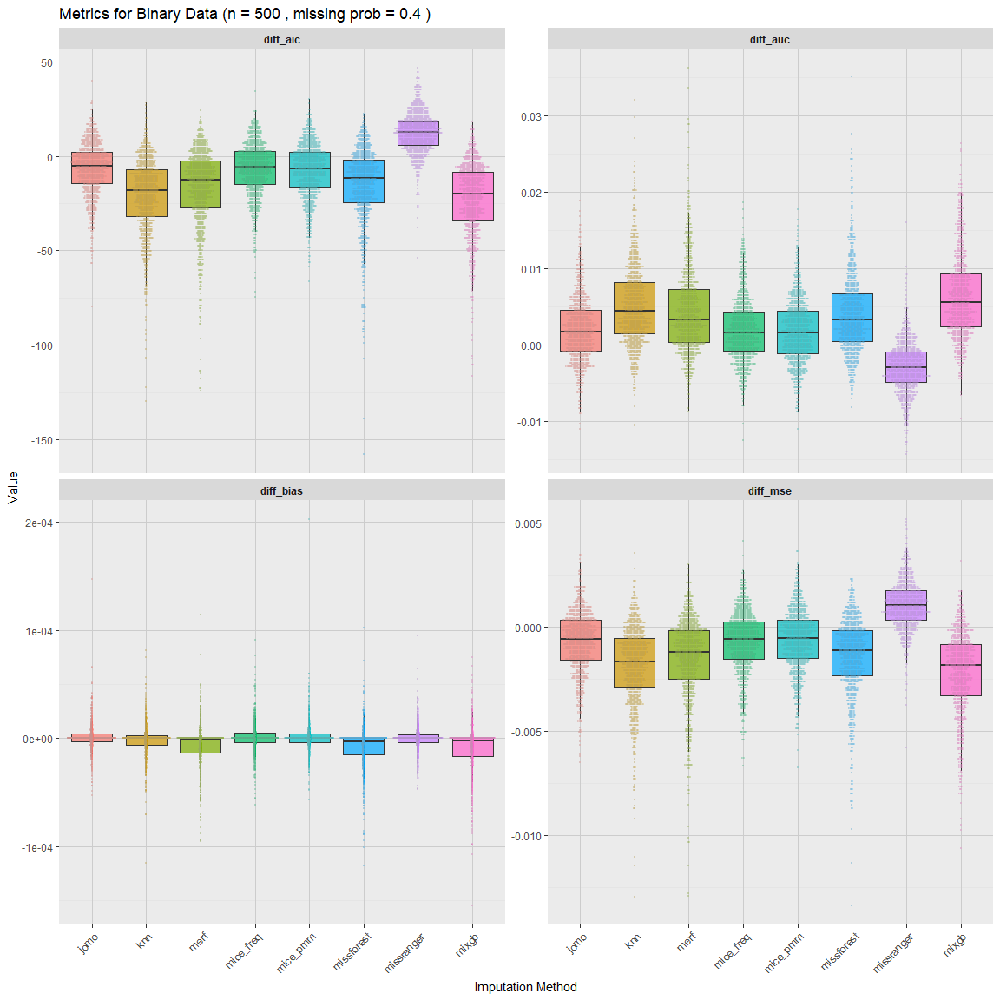
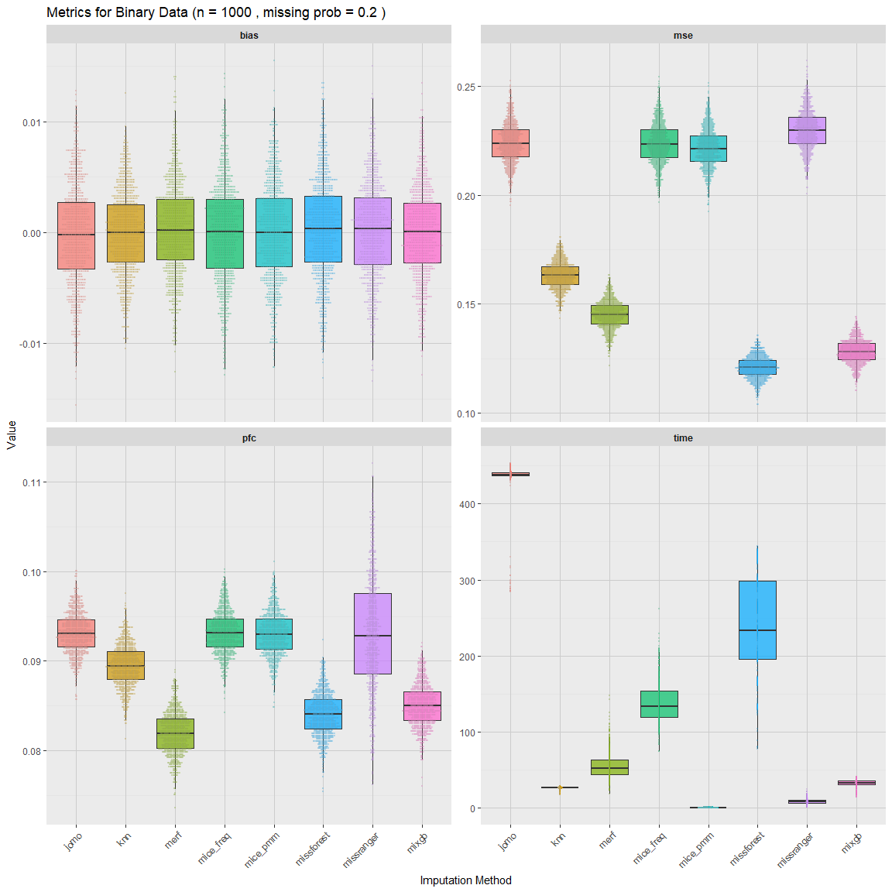
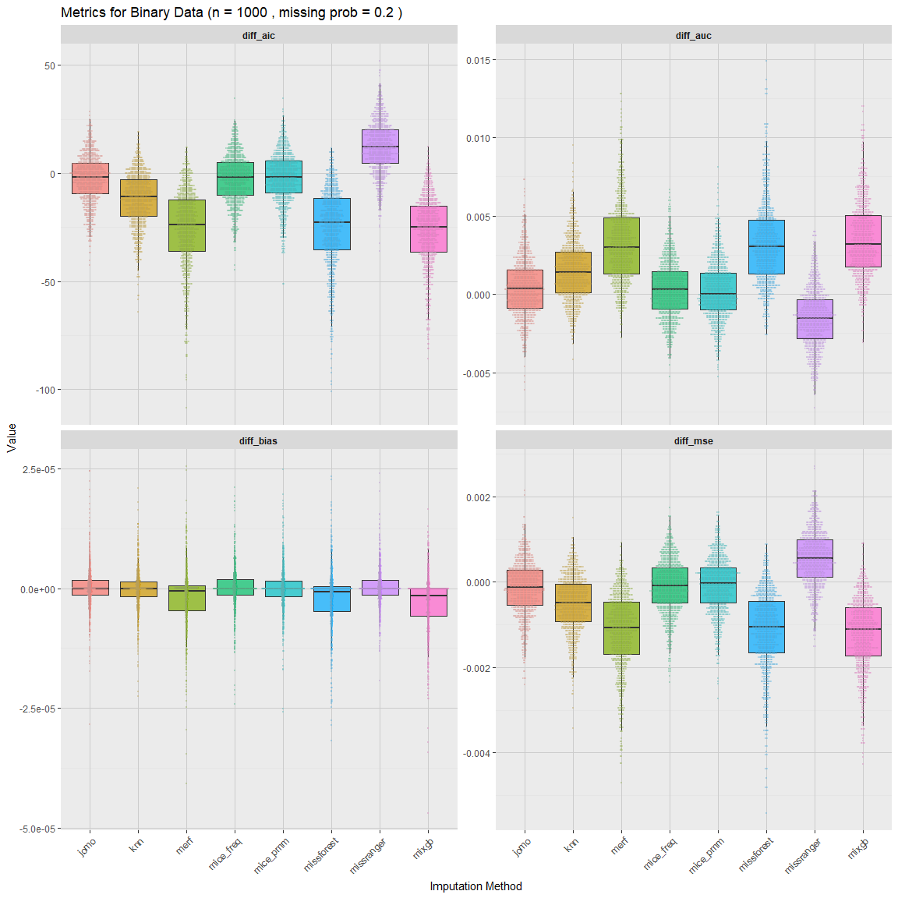
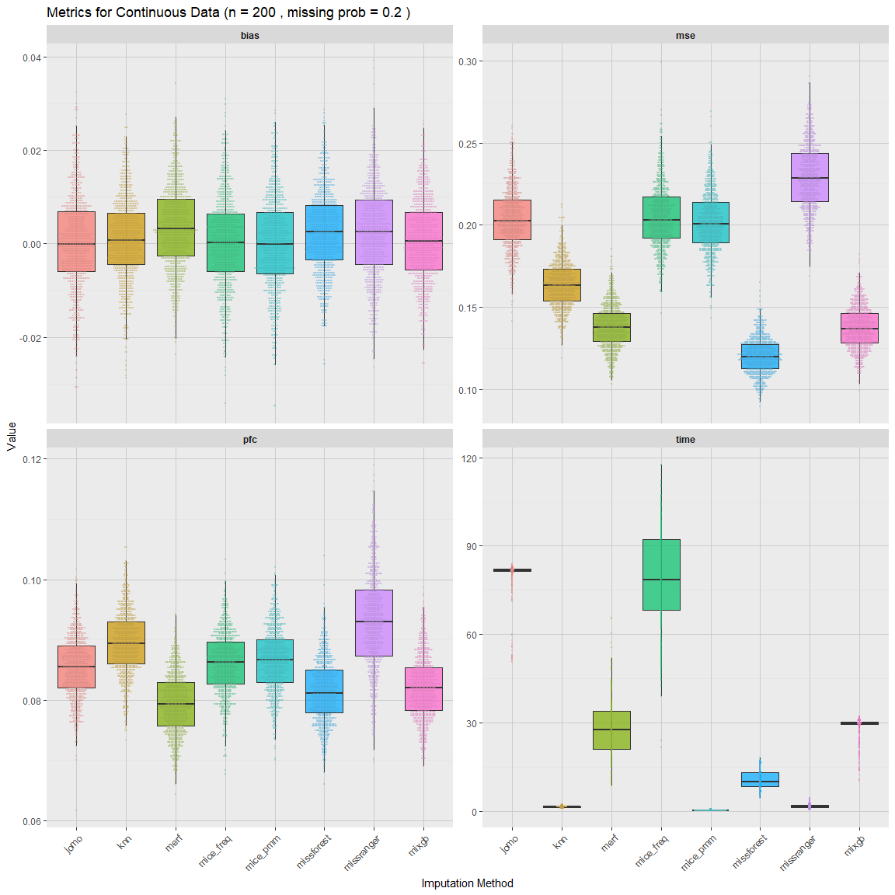
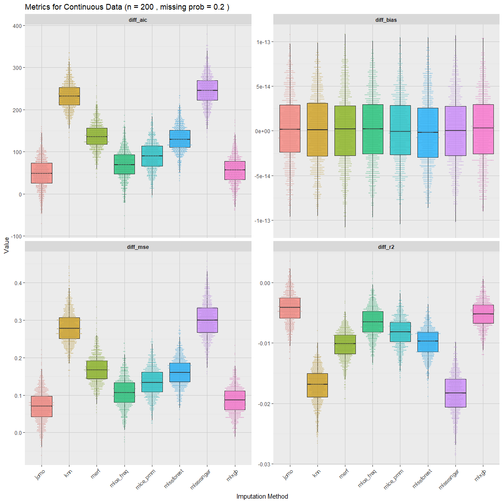
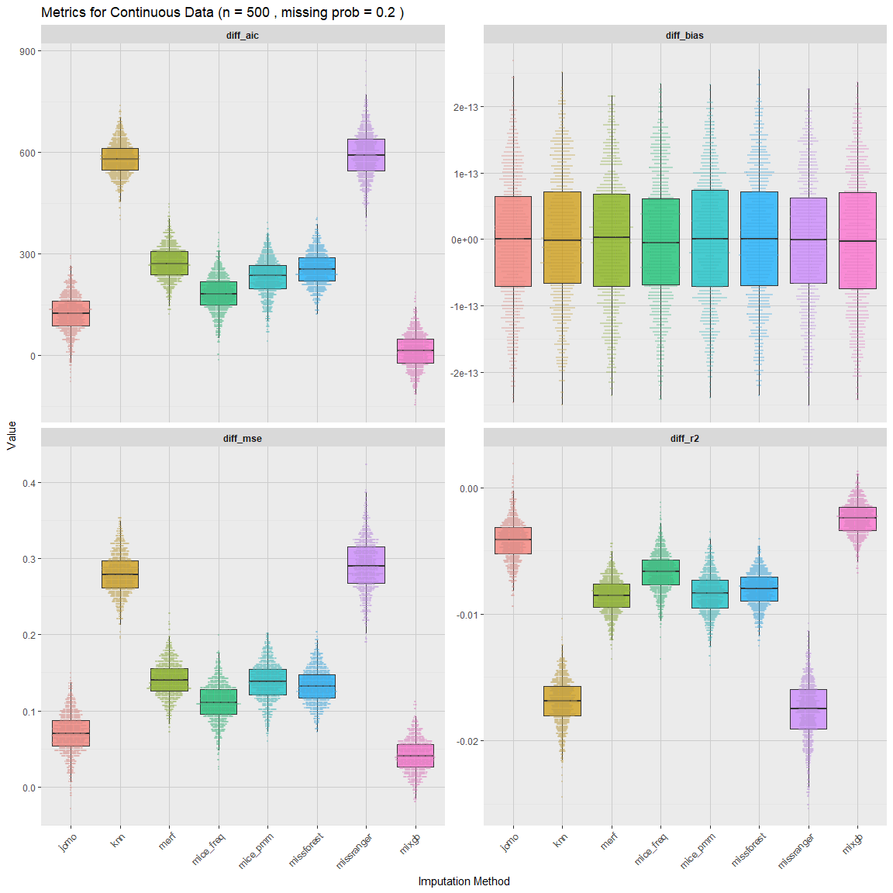
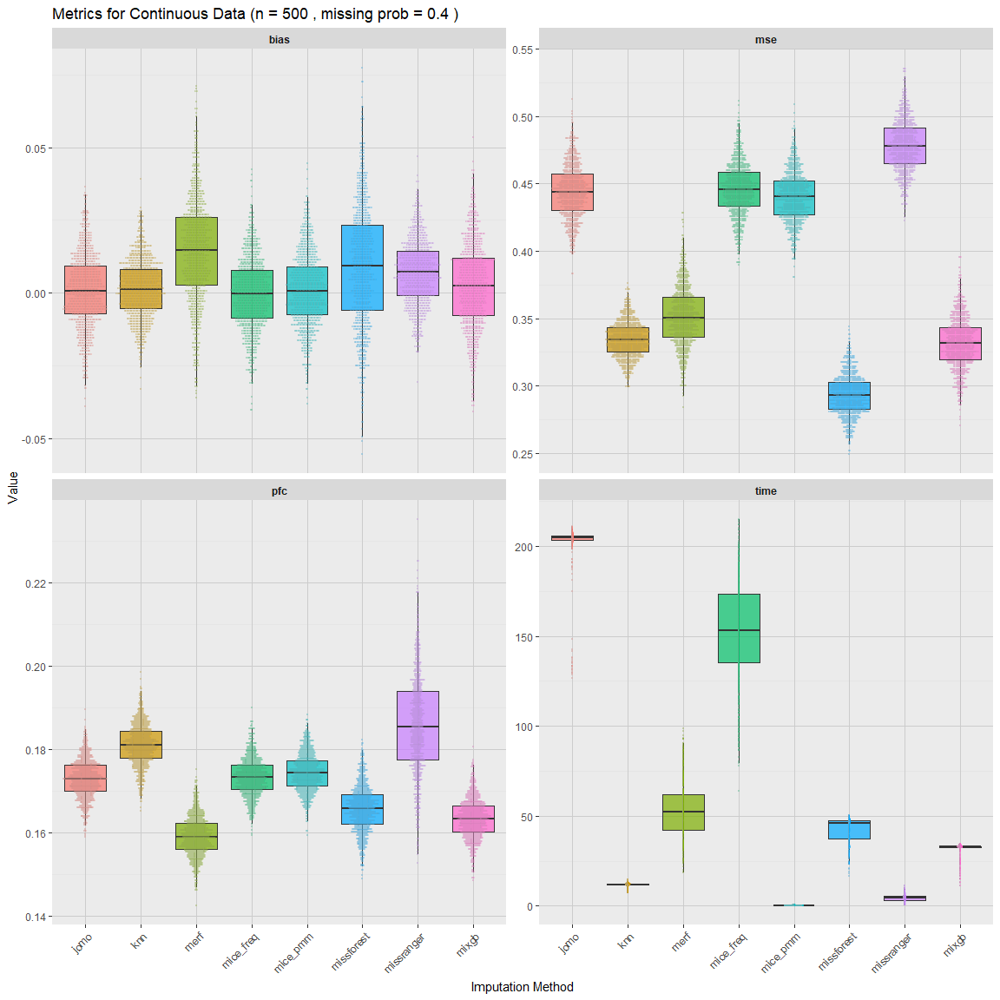
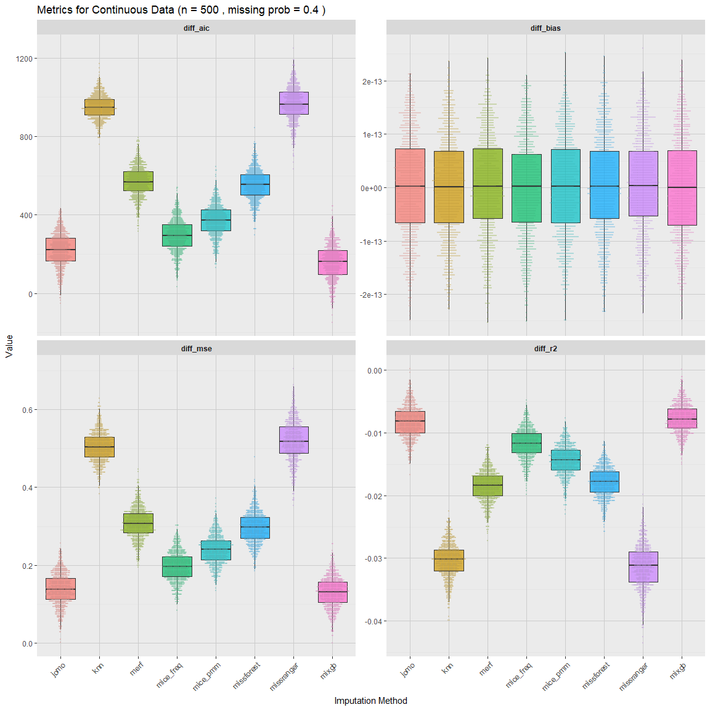

README
================

The goal of this project is to compare methods for imputing missing
data, specifically in the case of clustered data. Data were simulated
for both binary and continuous outcomes, in sample sizes of 200, 500 or
1000, and with either 20% or 40% missingness. Methods of imputation were
compared for each scenario in terms of relevant model fit statistics,
bias, and computation time. The results are as follows:

# Binary Outcome

### 200 subjects w/ 20% Missing Data

<!-- -->

<!-- <br/> -->
<!-- ```{r out2, echo=F, fig.width=12, fig.height=12} -->
<!-- plot_metrics(df_long, metric_set=2, type="bin", n_subj=200, miss_prob = .2) -->
<!-- ``` -->

<br/> <br/> <br/>

<!-- -->

<br/> <br/> —

### 200 subjects w/ 40% Missing Data

<!-- -->

<!-- <br/> -->
<!-- ```{r out5, echo=F, fig.width=12, fig.height=12} -->
<!-- plot_metrics(df_long, metric_set=2, type="bin", n_subj=200, miss_prob = .4) -->
<!-- ``` -->

<br/> <br/> <br/>

<!-- -->

<br/> <br/> —

### 500 subjects w/ 20% Missing Data

<!-- -->

<!-- <br/> -->
<!-- ```{r out8, echo=F, fig.width=12, fig.height=12} -->
<!-- plot_metrics(df_long, metric_set=2, type="bin", n_subj=500, miss_prob = .2) -->
<!-- ``` -->

<br/> <br/> <br/>

<!-- -->

<br/> <br/> —

### 500 subjects w/ 40% Missing Data

<!-- -->

<!-- <br/> -->
<!-- ```{r out11, echo=F, fig.width=12, fig.height=12} -->
<!-- plot_metrics(df_long, metric_set=2, type="bin", n_subj=500, miss_prob = .4) -->
<!-- ``` -->

<br/> <br/> <br/>

<!-- -->

<br/> <br/> —

### 1000 subjects w/ 20% Missing Data

<!-- -->

<!-- <br/> -->
<!-- ```{r out14, echo=F, fig.width=12, fig.height=12} -->
<!-- plot_metrics(df_long, metric_set=2, type="bin", n_subj=1000, miss_prob = .2) -->
<!-- ``` -->

<br/> <br/> <br/>

<!-- -->

<br/> <br/> —

### 1000 subjects w/ 40% Missing Data

<!-- -->

<!-- <br/> -->
<!-- ```{r out17, echo=F, fig.width=12, fig.height=12} -->
<!-- plot_metrics(df_long, metric_set=2, type="bin", n_subj=1000, miss_prob = .4) -->
<!-- ``` -->

<br/> <br/> <br/>

<!-- -->

------------------------------------------------------------------------

<br/> <br/> <br/>

# Continuous Data

### 200 subjects w/ 20% Missing Data

<!-- -->

<!-- <br/> -->
<!-- ```{r out20, echo=F, fig.width=12, fig.height=12} -->
<!-- plot_metrics(df_long, metric_set=2, type="continuous", n_subj=200, miss_prob = .2) -->
<!-- ``` -->

<br/> <br/> <br/>

<!-- -->

<br/> <br/> —

### 200 subjects w/ 40% Missing Data

<!-- -->

<!-- <br/> -->
<!-- ```{r out23, echo=F, fig.width=12, fig.height=12} -->
<!-- plot_metrics(df_long, metric_set=2, type="continuous", n_subj=200, miss_prob = .4) -->
<!-- ``` -->

<br/> <br/> <br/>

<!-- -->

<br/> <br/> —

### 500 subjects w/ 20% Missing Data

<!-- -->

<!-- <br/> -->
<!-- ```{r out26, echo=F, fig.width=12, fig.height=12} -->
<!-- plot_metrics(df_long, metric_set=2, type="continuous", n_subj=500, miss_prob = .2) -->
<!-- ``` -->

<br/> <br/> <br/>

<!-- -->

<br/> <br/> —

### 500 subjects w/ 40% Missing Data

<!-- -->

<!-- <br/> -->
<!-- ```{r out29, echo=F, fig.width=12, fig.height=12} -->
<!-- plot_metrics(df_long, metric_set=2, type="continuous", n_subj=500, miss_prob = .4) -->
<!-- ``` -->

<br/> <br/> <br/> <!-- -->

<br/> <br/> —

### 1000 subjects w/ 20% Missing Data

<!-- -->

<!-- <br/> -->
<!-- ```{r out32, echo=F, fig.width=12, fig.height=12} -->
<!-- plot_metrics(df_long, metric_set=2, type="continuous", n_subj=1000, miss_prob = .2) -->
<!-- ``` -->

<br/> <br/> <br/>

<!-- -->

<br/> <br/> —

### 1000 subjects w/ 40% Missing Data

<!-- -->

<!-- <br/> -->
<!-- ```{r out35, echo=F, fig.width=12, fig.height=12} -->
<!-- plot_metrics(df_long, metric_set=2, type="continuous", n_subj=1000, miss_prob = .4) -->
<!-- ``` -->

<br/> <br/> <br/>

<!-- -->

# Tables

    ## `summarise()` has grouped output by 'type', 'n_subj', 'miss_prob'. You can
    ## override using the `.groups` argument.

<table class="table" style="color: black; width: auto !important; margin-left: auto; margin-right: auto;">
<thead>
<tr>
<th style="text-align:center;">
Method
</th>
<th style="text-align:center;">
mse
</th>
<th style="text-align:center;">
mae
</th>
<th style="text-align:center;">
bias
</th>
<th style="text-align:center;">
pfc
</th>
</tr>
</thead>
<tbody>
<tr grouplength="8">
<td colspan="5" style="border-bottom: 1px solid;">
<strong>Binary, n=200, Missing Probability = 0.2</strong>
</td>
</tr>
<tr>
<td style="text-align:center;padding-left: 2em;" indentlevel="1">
jomo
</td>
<td style="text-align:center;">
0.23 (0.02)
</td>
<td style="text-align:center;">
0.15 (0.01)
</td>
<td style="text-align:center;">
-0.00 (0.01)
</td>
<td style="text-align:center;">
0.09 (0.01)
</td>
</tr>
<tr>
<td style="text-align:center;padding-left: 2em;" indentlevel="1">
knn
</td>
<td style="text-align:center;">
0.16 (0.01)
</td>
<td style="text-align:center;">
0.13 (0.01)
</td>
<td style="text-align:center;">
0.00 (0.01)
</td>
<td style="text-align:center;">
0.09 (0.01)
</td>
</tr>
<tr>
<td style="text-align:center;padding-left: 2em;" indentlevel="1">
merf
</td>
<td style="text-align:center;">
0.14 (0.01)
</td>
<td style="text-align:center;">
0.12 (0.01)
</td>
<td style="text-align:center;">
0.00 (0.01)
</td>
<td style="text-align:center;">
0.08 (0.00)
</td>
</tr>
<tr>
<td style="text-align:center;padding-left: 2em;" indentlevel="1">
mice_freq
</td>
<td style="text-align:center;">
0.23 (0.02)
</td>
<td style="text-align:center;">
0.15 (0.01)
</td>
<td style="text-align:center;">
-0.00 (0.01)
</td>
<td style="text-align:center;">
0.09 (0.01)
</td>
</tr>
<tr>
<td style="text-align:center;padding-left: 2em;" indentlevel="1">
mice_pmm
</td>
<td style="text-align:center;">
0.22 (0.02)
</td>
<td style="text-align:center;">
0.15 (0.01)
</td>
<td style="text-align:center;">
0.00 (0.01)
</td>
<td style="text-align:center;">
0.09 (0.01)
</td>
</tr>
<tr>
<td style="text-align:center;padding-left: 2em;" indentlevel="1">
missforest
</td>
<td style="text-align:center;">
0.12 (0.01)
</td>
<td style="text-align:center;">
0.11 (0.01)
</td>
<td style="text-align:center;">
0.00 (0.01)
</td>
<td style="text-align:center;">
0.09 (0.01)
</td>
</tr>
<tr>
<td style="text-align:center;padding-left: 2em;" indentlevel="1">
missranger
</td>
<td style="text-align:center;">
0.23 (0.02)
</td>
<td style="text-align:center;">
0.15 (0.01)
</td>
<td style="text-align:center;">
0.00 (0.01)
</td>
<td style="text-align:center;">
0.09 (0.01)
</td>
</tr>
<tr>
<td style="text-align:center;padding-left: 2em;" indentlevel="1">
mixgb
</td>
<td style="text-align:center;">
0.15 (0.01)
</td>
<td style="text-align:center;">
0.12 (0.01)
</td>
<td style="text-align:center;">
0.00 (0.01)
</td>
<td style="text-align:center;">
0.09 (0.01)
</td>
</tr>
<tr grouplength="8">
<td colspan="5" style="border-bottom: 1px solid;">
<strong>Binary, n=200, Missing Probability = 0.4</strong>
</td>
</tr>
<tr>
<td style="text-align:center;padding-left: 2em;" indentlevel="1">
jomo
</td>
<td style="text-align:center;">
0.50 (0.03)
</td>
<td style="text-align:center;">
0.32 (0.01)
</td>
<td style="text-align:center;">
-0.00 (0.02)
</td>
<td style="text-align:center;">
0.19 (0.01)
</td>
</tr>
<tr>
<td style="text-align:center;padding-left: 2em;" indentlevel="1">
knn
</td>
<td style="text-align:center;">
0.34 (0.02)
</td>
<td style="text-align:center;">
0.26 (0.01)
</td>
<td style="text-align:center;">
0.00 (0.02)
</td>
<td style="text-align:center;">
0.18 (0.01)
</td>
</tr>
<tr>
<td style="text-align:center;padding-left: 2em;" indentlevel="1">
merf
</td>
<td style="text-align:center;">
0.35 (0.03)
</td>
<td style="text-align:center;">
0.26 (0.01)
</td>
<td style="text-align:center;">
0.00 (0.02)
</td>
<td style="text-align:center;">
0.17 (0.01)
</td>
</tr>
<tr>
<td style="text-align:center;padding-left: 2em;" indentlevel="1">
mice_freq
</td>
<td style="text-align:center;">
0.50 (0.03)
</td>
<td style="text-align:center;">
0.32 (0.01)
</td>
<td style="text-align:center;">
-0.00 (0.02)
</td>
<td style="text-align:center;">
0.19 (0.01)
</td>
</tr>
<tr>
<td style="text-align:center;padding-left: 2em;" indentlevel="1">
mice_pmm
</td>
<td style="text-align:center;">
0.48 (0.03)
</td>
<td style="text-align:center;">
0.31 (0.01)
</td>
<td style="text-align:center;">
-0.00 (0.02)
</td>
<td style="text-align:center;">
0.19 (0.01)
</td>
</tr>
<tr>
<td style="text-align:center;padding-left: 2em;" indentlevel="1">
missforest
</td>
<td style="text-align:center;">
0.30 (0.02)
</td>
<td style="text-align:center;">
0.24 (0.01)
</td>
<td style="text-align:center;">
-0.00 (0.03)
</td>
<td style="text-align:center;">
0.18 (0.01)
</td>
</tr>
<tr>
<td style="text-align:center;padding-left: 2em;" indentlevel="1">
missranger
</td>
<td style="text-align:center;">
0.50 (0.03)
</td>
<td style="text-align:center;">
0.31 (0.01)
</td>
<td style="text-align:center;">
0.00 (0.02)
</td>
<td style="text-align:center;">
0.19 (0.01)
</td>
</tr>
<tr>
<td style="text-align:center;padding-left: 2em;" indentlevel="1">
mixgb
</td>
<td style="text-align:center;">
0.38 (0.03)
</td>
<td style="text-align:center;">
0.27 (0.01)
</td>
<td style="text-align:center;">
-0.00 (0.02)
</td>
<td style="text-align:center;">
0.18 (0.01)
</td>
</tr>
<tr grouplength="8">
<td colspan="5" style="border-bottom: 1px solid;">
<strong>Binary, n=500, Missing Probability = 0.2</strong>
</td>
</tr>
<tr>
<td style="text-align:center;padding-left: 2em;" indentlevel="1">
jomo
</td>
<td style="text-align:center;">
0.23 (0.01)
</td>
<td style="text-align:center;">
0.15 (0.01)
</td>
<td style="text-align:center;">
0.00 (0.01)
</td>
<td style="text-align:center;">
0.09 (0.00)
</td>
</tr>
<tr>
<td style="text-align:center;padding-left: 2em;" indentlevel="1">
knn
</td>
<td style="text-align:center;">
0.16 (0.01)
</td>
<td style="text-align:center;">
0.13 (0.00)
</td>
<td style="text-align:center;">
0.00 (0.01)
</td>
<td style="text-align:center;">
0.09 (0.00)
</td>
</tr>
<tr>
<td style="text-align:center;padding-left: 2em;" indentlevel="1">
merf
</td>
<td style="text-align:center;">
0.14 (0.01)
</td>
<td style="text-align:center;">
0.12 (0.00)
</td>
<td style="text-align:center;">
0.00 (0.01)
</td>
<td style="text-align:center;">
0.08 (0.00)
</td>
</tr>
<tr>
<td style="text-align:center;padding-left: 2em;" indentlevel="1">
mice_freq
</td>
<td style="text-align:center;">
0.23 (0.01)
</td>
<td style="text-align:center;">
0.15 (0.01)
</td>
<td style="text-align:center;">
0.00 (0.01)
</td>
<td style="text-align:center;">
0.09 (0.00)
</td>
</tr>
<tr>
<td style="text-align:center;padding-left: 2em;" indentlevel="1">
mice_pmm
</td>
<td style="text-align:center;">
0.22 (0.01)
</td>
<td style="text-align:center;">
0.15 (0.01)
</td>
<td style="text-align:center;">
-0.00 (0.01)
</td>
<td style="text-align:center;">
0.09 (0.00)
</td>
</tr>
<tr>
<td style="text-align:center;padding-left: 2em;" indentlevel="1">
missforest
</td>
<td style="text-align:center;">
0.12 (0.01)
</td>
<td style="text-align:center;">
0.11 (0.00)
</td>
<td style="text-align:center;">
0.00 (0.01)
</td>
<td style="text-align:center;">
0.08 (0.00)
</td>
</tr>
<tr>
<td style="text-align:center;padding-left: 2em;" indentlevel="1">
missranger
</td>
<td style="text-align:center;">
0.23 (0.01)
</td>
<td style="text-align:center;">
0.15 (0.01)
</td>
<td style="text-align:center;">
0.00 (0.01)
</td>
<td style="text-align:center;">
0.09 (0.01)
</td>
</tr>
<tr>
<td style="text-align:center;padding-left: 2em;" indentlevel="1">
mixgb
</td>
<td style="text-align:center;">
0.14 (0.01)
</td>
<td style="text-align:center;">
0.12 (0.00)
</td>
<td style="text-align:center;">
0.00 (0.01)
</td>
<td style="text-align:center;">
0.09 (0.00)
</td>
</tr>
<tr grouplength="8">
<td colspan="5" style="border-bottom: 1px solid;">
<strong>Binary, n=500, Missing Probability = 0.4</strong>
</td>
</tr>
<tr>
<td style="text-align:center;padding-left: 2em;" indentlevel="1">
jomo
</td>
<td style="text-align:center;">
0.49 (0.02)
</td>
<td style="text-align:center;">
0.31 (0.01)
</td>
<td style="text-align:center;">
-0.00 (0.01)
</td>
<td style="text-align:center;">
0.19 (0.00)
</td>
</tr>
<tr>
<td style="text-align:center;padding-left: 2em;" indentlevel="1">
knn
</td>
<td style="text-align:center;">
0.34 (0.01)
</td>
<td style="text-align:center;">
0.26 (0.01)
</td>
<td style="text-align:center;">
0.00 (0.01)
</td>
<td style="text-align:center;">
0.18 (0.00)
</td>
</tr>
<tr>
<td style="text-align:center;padding-left: 2em;" indentlevel="1">
merf
</td>
<td style="text-align:center;">
0.37 (0.02)
</td>
<td style="text-align:center;">
0.27 (0.01)
</td>
<td style="text-align:center;">
0.00 (0.02)
</td>
<td style="text-align:center;">
0.17 (0.00)
</td>
</tr>
<tr>
<td style="text-align:center;padding-left: 2em;" indentlevel="1">
mice_freq
</td>
<td style="text-align:center;">
0.49 (0.02)
</td>
<td style="text-align:center;">
0.31 (0.01)
</td>
<td style="text-align:center;">
-0.00 (0.01)
</td>
<td style="text-align:center;">
0.19 (0.00)
</td>
</tr>
<tr>
<td style="text-align:center;padding-left: 2em;" indentlevel="1">
mice_pmm
</td>
<td style="text-align:center;">
0.48 (0.02)
</td>
<td style="text-align:center;">
0.31 (0.01)
</td>
<td style="text-align:center;">
0.00 (0.01)
</td>
<td style="text-align:center;">
0.19 (0.00)
</td>
</tr>
<tr>
<td style="text-align:center;padding-left: 2em;" indentlevel="1">
missforest
</td>
<td style="text-align:center;">
0.30 (0.02)
</td>
<td style="text-align:center;">
0.24 (0.01)
</td>
<td style="text-align:center;">
0.00 (0.02)
</td>
<td style="text-align:center;">
0.17 (0.01)
</td>
</tr>
<tr>
<td style="text-align:center;padding-left: 2em;" indentlevel="1">
missranger
</td>
<td style="text-align:center;">
0.49 (0.02)
</td>
<td style="text-align:center;">
0.31 (0.01)
</td>
<td style="text-align:center;">
0.00 (0.01)
</td>
<td style="text-align:center;">
0.19 (0.01)
</td>
</tr>
<tr>
<td style="text-align:center;padding-left: 2em;" indentlevel="1">
mixgb
</td>
<td style="text-align:center;">
0.35 (0.02)
</td>
<td style="text-align:center;">
0.26 (0.01)
</td>
<td style="text-align:center;">
0.00 (0.02)
</td>
<td style="text-align:center;">
0.18 (0.00)
</td>
</tr>
<tr grouplength="8">
<td colspan="5" style="border-bottom: 1px solid;">
<strong>Binary, n=1000, Missing Probability = 0.2</strong>
</td>
</tr>
<tr>
<td style="text-align:center;padding-left: 2em;" indentlevel="1">
jomo
</td>
<td style="text-align:center;">
0.22 (0.01)
</td>
<td style="text-align:center;">
0.15 (0.00)
</td>
<td style="text-align:center;">
-0.00 (0.00)
</td>
<td style="text-align:center;">
0.09 (0.00)
</td>
</tr>
<tr>
<td style="text-align:center;padding-left: 2em;" indentlevel="1">
knn
</td>
<td style="text-align:center;">
0.16 (0.01)
</td>
<td style="text-align:center;">
0.13 (0.00)
</td>
<td style="text-align:center;">
-0.00 (0.00)
</td>
<td style="text-align:center;">
0.09 (0.00)
</td>
</tr>
<tr>
<td style="text-align:center;padding-left: 2em;" indentlevel="1">
merf
</td>
<td style="text-align:center;">
0.15 (0.01)
</td>
<td style="text-align:center;">
0.12 (0.00)
</td>
<td style="text-align:center;">
0.00 (0.00)
</td>
<td style="text-align:center;">
0.08 (0.00)
</td>
</tr>
<tr>
<td style="text-align:center;padding-left: 2em;" indentlevel="1">
mice_freq
</td>
<td style="text-align:center;">
0.22 (0.01)
</td>
<td style="text-align:center;">
0.15 (0.00)
</td>
<td style="text-align:center;">
-0.00 (0.00)
</td>
<td style="text-align:center;">
0.09 (0.00)
</td>
</tr>
<tr>
<td style="text-align:center;padding-left: 2em;" indentlevel="1">
mice_pmm
</td>
<td style="text-align:center;">
0.22 (0.01)
</td>
<td style="text-align:center;">
0.15 (0.00)
</td>
<td style="text-align:center;">
0.00 (0.00)
</td>
<td style="text-align:center;">
0.09 (0.00)
</td>
</tr>
<tr>
<td style="text-align:center;padding-left: 2em;" indentlevel="1">
missforest
</td>
<td style="text-align:center;">
0.12 (0.01)
</td>
<td style="text-align:center;">
0.11 (0.00)
</td>
<td style="text-align:center;">
0.00 (0.00)
</td>
<td style="text-align:center;">
0.08 (0.00)
</td>
</tr>
<tr>
<td style="text-align:center;padding-left: 2em;" indentlevel="1">
missranger
</td>
<td style="text-align:center;">
0.23 (0.01)
</td>
<td style="text-align:center;">
0.15 (0.00)
</td>
<td style="text-align:center;">
0.00 (0.00)
</td>
<td style="text-align:center;">
0.09 (0.01)
</td>
</tr>
<tr>
<td style="text-align:center;padding-left: 2em;" indentlevel="1">
mixgb
</td>
<td style="text-align:center;">
0.13 (0.01)
</td>
<td style="text-align:center;">
0.11 (0.00)
</td>
<td style="text-align:center;">
-0.00 (0.00)
</td>
<td style="text-align:center;">
0.09 (0.00)
</td>
</tr>
<tr grouplength="8">
<td colspan="5" style="border-bottom: 1px solid;">
<strong>Binary, n=1000, Missing Probability = 0.4</strong>
</td>
</tr>
<tr>
<td style="text-align:center;padding-left: 2em;" indentlevel="1">
jomo
</td>
<td style="text-align:center;">
0.49 (0.02)
</td>
<td style="text-align:center;">
0.31 (0.01)
</td>
<td style="text-align:center;">
-0.00 (0.01)
</td>
<td style="text-align:center;">
0.19 (0.00)
</td>
</tr>
<tr>
<td style="text-align:center;padding-left: 2em;" indentlevel="1">
knn
</td>
<td style="text-align:center;">
0.34 (0.01)
</td>
<td style="text-align:center;">
0.26 (0.00)
</td>
<td style="text-align:center;">
-0.00 (0.01)
</td>
<td style="text-align:center;">
0.18 (0.00)
</td>
</tr>
<tr>
<td style="text-align:center;padding-left: 2em;" indentlevel="1">
merf
</td>
<td style="text-align:center;">
0.38 (0.02)
</td>
<td style="text-align:center;">
0.27 (0.01)
</td>
<td style="text-align:center;">
0.00 (0.01)
</td>
<td style="text-align:center;">
0.17 (0.00)
</td>
</tr>
<tr>
<td style="text-align:center;padding-left: 2em;" indentlevel="1">
mice_freq
</td>
<td style="text-align:center;">
0.48 (0.01)
</td>
<td style="text-align:center;">
0.31 (0.01)
</td>
<td style="text-align:center;">
-0.00 (0.01)
</td>
<td style="text-align:center;">
0.19 (0.00)
</td>
</tr>
<tr>
<td style="text-align:center;padding-left: 2em;" indentlevel="1">
mice_pmm
</td>
<td style="text-align:center;">
0.48 (0.01)
</td>
<td style="text-align:center;">
0.31 (0.01)
</td>
<td style="text-align:center;">
-0.00 (0.01)
</td>
<td style="text-align:center;">
0.19 (0.00)
</td>
</tr>
<tr>
<td style="text-align:center;padding-left: 2em;" indentlevel="1">
missforest
</td>
<td style="text-align:center;">
0.30 (0.01)
</td>
<td style="text-align:center;">
0.24 (0.01)
</td>
<td style="text-align:center;">
0.00 (0.02)
</td>
<td style="text-align:center;">
0.17 (0.00)
</td>
</tr>
<tr>
<td style="text-align:center;padding-left: 2em;" indentlevel="1">
missranger
</td>
<td style="text-align:center;">
0.49 (0.01)
</td>
<td style="text-align:center;">
0.31 (0.01)
</td>
<td style="text-align:center;">
0.00 (0.01)
</td>
<td style="text-align:center;">
0.19 (0.01)
</td>
</tr>
<tr>
<td style="text-align:center;padding-left: 2em;" indentlevel="1">
mixgb
</td>
<td style="text-align:center;">
0.33 (0.02)
</td>
<td style="text-align:center;">
0.25 (0.01)
</td>
<td style="text-align:center;">
0.00 (0.01)
</td>
<td style="text-align:center;">
0.17 (0.00)
</td>
</tr>
</tbody>
</table>

<br/> <br/> <br/>

    ## `summarise()` has grouped output by 'type', 'n_subj', 'miss_prob'. You can
    ## override using the `.groups` argument.

<table class="table" style="color: black; width: auto !important; margin-left: auto; margin-right: auto;">
<thead>
<tr>
<th style="text-align:center;">
Method
</th>
<th style="text-align:center;">
mse
</th>
<th style="text-align:center;">
mae
</th>
<th style="text-align:center;">
bias
</th>
<th style="text-align:center;">
pfc
</th>
</tr>
</thead>
<tbody>
<tr grouplength="8">
<td colspan="5" style="border-bottom: 1px solid;">
<strong>Continuous, n=200, Missing Probability = 0.2</strong>
</td>
</tr>
<tr>
<td style="text-align:center;padding-left: 2em;" indentlevel="1">
jomo
</td>
<td style="text-align:center;">
0.20 (0.02)
</td>
<td style="text-align:center;">
0.14 (0.01)
</td>
<td style="text-align:center;">
0.00 (0.01)
</td>
<td style="text-align:center;">
0.09 (0.01)
</td>
</tr>
<tr>
<td style="text-align:center;padding-left: 2em;" indentlevel="1">
knn
</td>
<td style="text-align:center;">
0.16 (0.01)
</td>
<td style="text-align:center;">
0.13 (0.01)
</td>
<td style="text-align:center;">
0.00 (0.01)
</td>
<td style="text-align:center;">
0.09 (0.01)
</td>
</tr>
<tr>
<td style="text-align:center;padding-left: 2em;" indentlevel="1">
merf
</td>
<td style="text-align:center;">
0.14 (0.01)
</td>
<td style="text-align:center;">
0.12 (0.01)
</td>
<td style="text-align:center;">
0.00 (0.01)
</td>
<td style="text-align:center;">
0.08 (0.01)
</td>
</tr>
<tr>
<td style="text-align:center;padding-left: 2em;" indentlevel="1">
mice_freq
</td>
<td style="text-align:center;">
0.21 (0.02)
</td>
<td style="text-align:center;">
0.14 (0.01)
</td>
<td style="text-align:center;">
0.00 (0.01)
</td>
<td style="text-align:center;">
0.09 (0.01)
</td>
</tr>
<tr>
<td style="text-align:center;padding-left: 2em;" indentlevel="1">
mice_pmm
</td>
<td style="text-align:center;">
0.20 (0.02)
</td>
<td style="text-align:center;">
0.14 (0.01)
</td>
<td style="text-align:center;">
-0.00 (0.01)
</td>
<td style="text-align:center;">
0.09 (0.01)
</td>
</tr>
<tr>
<td style="text-align:center;padding-left: 2em;" indentlevel="1">
missforest
</td>
<td style="text-align:center;">
0.12 (0.01)
</td>
<td style="text-align:center;">
0.11 (0.01)
</td>
<td style="text-align:center;">
0.00 (0.01)
</td>
<td style="text-align:center;">
0.08 (0.01)
</td>
</tr>
<tr>
<td style="text-align:center;padding-left: 2em;" indentlevel="1">
missranger
</td>
<td style="text-align:center;">
0.23 (0.02)
</td>
<td style="text-align:center;">
0.15 (0.01)
</td>
<td style="text-align:center;">
0.00 (0.01)
</td>
<td style="text-align:center;">
0.09 (0.01)
</td>
</tr>
<tr>
<td style="text-align:center;padding-left: 2em;" indentlevel="1">
mixgb
</td>
<td style="text-align:center;">
0.14 (0.01)
</td>
<td style="text-align:center;">
0.12 (0.01)
</td>
<td style="text-align:center;">
0.00 (0.01)
</td>
<td style="text-align:center;">
0.08 (0.01)
</td>
</tr>
<tr grouplength="8">
<td colspan="5" style="border-bottom: 1px solid;">
<strong>Continuous, n=200, Missing Probability = 0.4</strong>
</td>
</tr>
<tr>
<td style="text-align:center;padding-left: 2em;" indentlevel="1">
jomo
</td>
<td style="text-align:center;">
0.46 (0.03)
</td>
<td style="text-align:center;">
0.30 (0.01)
</td>
<td style="text-align:center;">
-0.00 (0.02)
</td>
<td style="text-align:center;">
0.17 (0.01)
</td>
</tr>
<tr>
<td style="text-align:center;padding-left: 2em;" indentlevel="1">
knn
</td>
<td style="text-align:center;">
0.34 (0.02)
</td>
<td style="text-align:center;">
0.26 (0.01)
</td>
<td style="text-align:center;">
0.00 (0.02)
</td>
<td style="text-align:center;">
0.18 (0.01)
</td>
</tr>
<tr>
<td style="text-align:center;padding-left: 2em;" indentlevel="1">
merf
</td>
<td style="text-align:center;">
0.34 (0.03)
</td>
<td style="text-align:center;">
0.26 (0.01)
</td>
<td style="text-align:center;">
0.01 (0.03)
</td>
<td style="text-align:center;">
0.16 (0.01)
</td>
</tr>
<tr>
<td style="text-align:center;padding-left: 2em;" indentlevel="1">
mice_freq
</td>
<td style="text-align:center;">
0.46 (0.03)
</td>
<td style="text-align:center;">
0.30 (0.01)
</td>
<td style="text-align:center;">
-0.00 (0.02)
</td>
<td style="text-align:center;">
0.17 (0.01)
</td>
</tr>
<tr>
<td style="text-align:center;padding-left: 2em;" indentlevel="1">
mice_pmm
</td>
<td style="text-align:center;">
0.45 (0.03)
</td>
<td style="text-align:center;">
0.30 (0.01)
</td>
<td style="text-align:center;">
0.00 (0.02)
</td>
<td style="text-align:center;">
0.17 (0.01)
</td>
</tr>
<tr>
<td style="text-align:center;padding-left: 2em;" indentlevel="1">
missforest
</td>
<td style="text-align:center;">
0.29 (0.02)
</td>
<td style="text-align:center;">
0.24 (0.01)
</td>
<td style="text-align:center;">
0.01 (0.03)
</td>
<td style="text-align:center;">
0.17 (0.01)
</td>
</tr>
<tr>
<td style="text-align:center;padding-left: 2em;" indentlevel="1">
missranger
</td>
<td style="text-align:center;">
0.49 (0.03)
</td>
<td style="text-align:center;">
0.31 (0.01)
</td>
<td style="text-align:center;">
0.01 (0.02)
</td>
<td style="text-align:center;">
0.19 (0.01)
</td>
</tr>
<tr>
<td style="text-align:center;padding-left: 2em;" indentlevel="1">
mixgb
</td>
<td style="text-align:center;">
0.35 (0.03)
</td>
<td style="text-align:center;">
0.26 (0.01)
</td>
<td style="text-align:center;">
0.00 (0.02)
</td>
<td style="text-align:center;">
0.17 (0.01)
</td>
</tr>
<tr grouplength="8">
<td colspan="5" style="border-bottom: 1px solid;">
<strong>Continuous, n=500, Missing Probability = 0.2</strong>
</td>
</tr>
<tr>
<td style="text-align:center;padding-left: 2em;" indentlevel="1">
jomo
</td>
<td style="text-align:center;">
0.20 (0.01)
</td>
<td style="text-align:center;">
0.14 (0.01)
</td>
<td style="text-align:center;">
0.00 (0.01)
</td>
<td style="text-align:center;">
0.09 (0.00)
</td>
</tr>
<tr>
<td style="text-align:center;padding-left: 2em;" indentlevel="1">
knn
</td>
<td style="text-align:center;">
0.16 (0.01)
</td>
<td style="text-align:center;">
0.13 (0.00)
</td>
<td style="text-align:center;">
0.00 (0.01)
</td>
<td style="text-align:center;">
0.09 (0.00)
</td>
</tr>
<tr>
<td style="text-align:center;padding-left: 2em;" indentlevel="1">
merf
</td>
<td style="text-align:center;">
0.14 (0.01)
</td>
<td style="text-align:center;">
0.12 (0.00)
</td>
<td style="text-align:center;">
0.00 (0.01)
</td>
<td style="text-align:center;">
0.08 (0.00)
</td>
</tr>
<tr>
<td style="text-align:center;padding-left: 2em;" indentlevel="1">
mice_freq
</td>
<td style="text-align:center;">
0.20 (0.01)
</td>
<td style="text-align:center;">
0.14 (0.01)
</td>
<td style="text-align:center;">
0.00 (0.01)
</td>
<td style="text-align:center;">
0.09 (0.00)
</td>
</tr>
<tr>
<td style="text-align:center;padding-left: 2em;" indentlevel="1">
mice_pmm
</td>
<td style="text-align:center;">
0.20 (0.01)
</td>
<td style="text-align:center;">
0.14 (0.00)
</td>
<td style="text-align:center;">
-0.00 (0.01)
</td>
<td style="text-align:center;">
0.09 (0.00)
</td>
</tr>
<tr>
<td style="text-align:center;padding-left: 2em;" indentlevel="1">
missforest
</td>
<td style="text-align:center;">
0.12 (0.01)
</td>
<td style="text-align:center;">
0.11 (0.00)
</td>
<td style="text-align:center;">
0.00 (0.01)
</td>
<td style="text-align:center;">
0.08 (0.00)
</td>
</tr>
<tr>
<td style="text-align:center;padding-left: 2em;" indentlevel="1">
missranger
</td>
<td style="text-align:center;">
0.22 (0.01)
</td>
<td style="text-align:center;">
0.15 (0.01)
</td>
<td style="text-align:center;">
0.00 (0.01)
</td>
<td style="text-align:center;">
0.09 (0.01)
</td>
</tr>
<tr>
<td style="text-align:center;padding-left: 2em;" indentlevel="1">
mixgb
</td>
<td style="text-align:center;">
0.12 (0.01)
</td>
<td style="text-align:center;">
0.11 (0.00)
</td>
<td style="text-align:center;">
0.00 (0.01)
</td>
<td style="text-align:center;">
0.08 (0.00)
</td>
</tr>
<tr grouplength="8">
<td colspan="5" style="border-bottom: 1px solid;">
<strong>Continuous, n=500, Missing Probability = 0.4</strong>
</td>
</tr>
<tr>
<td style="text-align:center;padding-left: 2em;" indentlevel="1">
jomo
</td>
<td style="text-align:center;">
0.44 (0.02)
</td>
<td style="text-align:center;">
0.30 (0.01)
</td>
<td style="text-align:center;">
0.00 (0.01)
</td>
<td style="text-align:center;">
0.17 (0.00)
</td>
</tr>
<tr>
<td style="text-align:center;padding-left: 2em;" indentlevel="1">
knn
</td>
<td style="text-align:center;">
0.33 (0.01)
</td>
<td style="text-align:center;">
0.26 (0.01)
</td>
<td style="text-align:center;">
0.00 (0.01)
</td>
<td style="text-align:center;">
0.18 (0.00)
</td>
</tr>
<tr>
<td style="text-align:center;padding-left: 2em;" indentlevel="1">
merf
</td>
<td style="text-align:center;">
0.35 (0.02)
</td>
<td style="text-align:center;">
0.26 (0.01)
</td>
<td style="text-align:center;">
0.01 (0.02)
</td>
<td style="text-align:center;">
0.16 (0.00)
</td>
</tr>
<tr>
<td style="text-align:center;padding-left: 2em;" indentlevel="1">
mice_freq
</td>
<td style="text-align:center;">
0.45 (0.02)
</td>
<td style="text-align:center;">
0.30 (0.01)
</td>
<td style="text-align:center;">
-0.00 (0.01)
</td>
<td style="text-align:center;">
0.17 (0.00)
</td>
</tr>
<tr>
<td style="text-align:center;padding-left: 2em;" indentlevel="1">
mice_pmm
</td>
<td style="text-align:center;">
0.44 (0.02)
</td>
<td style="text-align:center;">
0.29 (0.01)
</td>
<td style="text-align:center;">
0.00 (0.01)
</td>
<td style="text-align:center;">
0.17 (0.00)
</td>
</tr>
<tr>
<td style="text-align:center;padding-left: 2em;" indentlevel="1">
missforest
</td>
<td style="text-align:center;">
0.29 (0.02)
</td>
<td style="text-align:center;">
0.24 (0.01)
</td>
<td style="text-align:center;">
0.01 (0.02)
</td>
<td style="text-align:center;">
0.17 (0.01)
</td>
</tr>
<tr>
<td style="text-align:center;padding-left: 2em;" indentlevel="1">
missranger
</td>
<td style="text-align:center;">
0.48 (0.02)
</td>
<td style="text-align:center;">
0.31 (0.01)
</td>
<td style="text-align:center;">
0.01 (0.01)
</td>
<td style="text-align:center;">
0.19 (0.01)
</td>
</tr>
<tr>
<td style="text-align:center;padding-left: 2em;" indentlevel="1">
mixgb
</td>
<td style="text-align:center;">
0.33 (0.02)
</td>
<td style="text-align:center;">
0.25 (0.01)
</td>
<td style="text-align:center;">
0.00 (0.01)
</td>
<td style="text-align:center;">
0.16 (0.00)
</td>
</tr>
<tr grouplength="8">
<td colspan="5" style="border-bottom: 1px solid;">
<strong>Continuous, n=1000, Missing Probability = 0.2</strong>
</td>
</tr>
<tr>
<td style="text-align:center;padding-left: 2em;" indentlevel="1">
jomo
</td>
<td style="text-align:center;">
0.20 (0.01)
</td>
<td style="text-align:center;">
0.14 (0.00)
</td>
<td style="text-align:center;">
0.00 (0.00)
</td>
<td style="text-align:center;">
0.09 (0.00)
</td>
</tr>
<tr>
<td style="text-align:center;padding-left: 2em;" indentlevel="1">
knn
</td>
<td style="text-align:center;">
0.16 (0.01)
</td>
<td style="text-align:center;">
0.13 (0.00)
</td>
<td style="text-align:center;">
0.00 (0.00)
</td>
<td style="text-align:center;">
0.09 (0.00)
</td>
</tr>
<tr>
<td style="text-align:center;padding-left: 2em;" indentlevel="1">
merf
</td>
<td style="text-align:center;">
0.14 (0.01)
</td>
<td style="text-align:center;">
0.12 (0.00)
</td>
<td style="text-align:center;">
0.00 (0.00)
</td>
<td style="text-align:center;">
0.08 (0.00)
</td>
</tr>
<tr>
<td style="text-align:center;padding-left: 2em;" indentlevel="1">
mice_freq
</td>
<td style="text-align:center;">
0.20 (0.01)
</td>
<td style="text-align:center;">
0.14 (0.00)
</td>
<td style="text-align:center;">
0.00 (0.00)
</td>
<td style="text-align:center;">
0.09 (0.00)
</td>
</tr>
<tr>
<td style="text-align:center;padding-left: 2em;" indentlevel="1">
mice_pmm
</td>
<td style="text-align:center;">
0.20 (0.01)
</td>
<td style="text-align:center;">
0.14 (0.00)
</td>
<td style="text-align:center;">
0.00 (0.00)
</td>
<td style="text-align:center;">
0.09 (0.00)
</td>
</tr>
<tr>
<td style="text-align:center;padding-left: 2em;" indentlevel="1">
missforest
</td>
<td style="text-align:center;">
0.12 (0.00)
</td>
<td style="text-align:center;">
0.11 (0.00)
</td>
<td style="text-align:center;">
0.00 (0.00)
</td>
<td style="text-align:center;">
0.08 (0.00)
</td>
</tr>
<tr>
<td style="text-align:center;padding-left: 2em;" indentlevel="1">
missranger
</td>
<td style="text-align:center;">
0.22 (0.01)
</td>
<td style="text-align:center;">
0.15 (0.00)
</td>
<td style="text-align:center;">
0.00 (0.00)
</td>
<td style="text-align:center;">
0.09 (0.01)
</td>
</tr>
<tr>
<td style="text-align:center;padding-left: 2em;" indentlevel="1">
mixgb
</td>
<td style="text-align:center;">
0.12 (0.00)
</td>
<td style="text-align:center;">
0.11 (0.00)
</td>
<td style="text-align:center;">
0.00 (0.00)
</td>
<td style="text-align:center;">
0.08 (0.00)
</td>
</tr>
<tr grouplength="8">
<td colspan="5" style="border-bottom: 1px solid;">
<strong>Continuous, n=1000, Missing Probability = 0.4</strong>
</td>
</tr>
<tr>
<td style="text-align:center;padding-left: 2em;" indentlevel="1">
jomo
</td>
<td style="text-align:center;">
0.44 (0.01)
</td>
<td style="text-align:center;">
0.29 (0.01)
</td>
<td style="text-align:center;">
-0.00 (0.01)
</td>
<td style="text-align:center;">
0.17 (0.00)
</td>
</tr>
<tr>
<td style="text-align:center;padding-left: 2em;" indentlevel="1">
knn
</td>
<td style="text-align:center;">
0.33 (0.01)
</td>
<td style="text-align:center;">
0.26 (0.00)
</td>
<td style="text-align:center;">
0.00 (0.01)
</td>
<td style="text-align:center;">
0.18 (0.00)
</td>
</tr>
<tr>
<td style="text-align:center;padding-left: 2em;" indentlevel="1">
merf
</td>
<td style="text-align:center;">
0.37 (0.02)
</td>
<td style="text-align:center;">
0.27 (0.01)
</td>
<td style="text-align:center;">
0.01 (0.01)
</td>
<td style="text-align:center;">
0.16 (0.00)
</td>
</tr>
<tr>
<td style="text-align:center;padding-left: 2em;" indentlevel="1">
mice_freq
</td>
<td style="text-align:center;">
0.44 (0.01)
</td>
<td style="text-align:center;">
0.30 (0.01)
</td>
<td style="text-align:center;">
0.00 (0.01)
</td>
<td style="text-align:center;">
0.17 (0.00)
</td>
</tr>
<tr>
<td style="text-align:center;padding-left: 2em;" indentlevel="1">
mice_pmm
</td>
<td style="text-align:center;">
0.44 (0.01)
</td>
<td style="text-align:center;">
0.29 (0.00)
</td>
<td style="text-align:center;">
0.00 (0.01)
</td>
<td style="text-align:center;">
0.17 (0.00)
</td>
</tr>
<tr>
<td style="text-align:center;padding-left: 2em;" indentlevel="1">
missforest
</td>
<td style="text-align:center;">
0.29 (0.01)
</td>
<td style="text-align:center;">
0.24 (0.01)
</td>
<td style="text-align:center;">
0.01 (0.02)
</td>
<td style="text-align:center;">
0.16 (0.00)
</td>
</tr>
<tr>
<td style="text-align:center;padding-left: 2em;" indentlevel="1">
missranger
</td>
<td style="text-align:center;">
0.47 (0.01)
</td>
<td style="text-align:center;">
0.30 (0.01)
</td>
<td style="text-align:center;">
0.01 (0.01)
</td>
<td style="text-align:center;">
0.18 (0.01)
</td>
</tr>
<tr>
<td style="text-align:center;padding-left: 2em;" indentlevel="1">
mixgb
</td>
<td style="text-align:center;">
0.32 (0.02)
</td>
<td style="text-align:center;">
0.25 (0.01)
</td>
<td style="text-align:center;">
0.00 (0.01)
</td>
<td style="text-align:center;">
0.16 (0.00)
</td>
</tr>
</tbody>
</table>

<br/> <br/> <br/>

    ## `summarise()` has grouped output by 'type', 'n_subj', 'miss_prob'. You can
    ## override using the `.groups` argument.

<table class="table" style="color: black; width: auto !important; margin-left: auto; margin-right: auto;">
<thead>
<tr>
<th style="text-align:center;">
Method
</th>
<th style="text-align:center;">
diff_mse
</th>
<th style="text-align:center;">
diff_mae
</th>
<th style="text-align:center;">
diff_bias
</th>
<th style="text-align:center;">
diff_aic
</th>
<th style="text-align:center;">
diff_auc
</th>
</tr>
</thead>
<tbody>
<tr grouplength="8">
<td colspan="6" style="border-bottom: 1px solid;">
<strong>Binary, n=200, Missing Probability = 0.2</strong>
</td>
</tr>
<tr>
<td style="text-align:center;padding-left: 2em;" indentlevel="1">
jomo
</td>
<td style="text-align:center;">
-0.00 (0.00)
</td>
<td style="text-align:center;">
-0.00 (0.00)
</td>
<td style="text-align:center;">
-0.00 (0.00)
</td>
<td style="text-align:center;">
-3.03 (6.01)
</td>
<td style="text-align:center;">
0.00 (0.00)
</td>
</tr>
<tr>
<td style="text-align:center;padding-left: 2em;" indentlevel="1">
knn
</td>
<td style="text-align:center;">
-0.00 (0.00)
</td>
<td style="text-align:center;">
-0.00 (0.00)
</td>
<td style="text-align:center;">
-0.00 (0.00)
</td>
<td style="text-align:center;">
-4.32 (6.15)
</td>
<td style="text-align:center;">
0.00 (0.00)
</td>
</tr>
<tr>
<td style="text-align:center;padding-left: 2em;" indentlevel="1">
merf
</td>
<td style="text-align:center;">
-0.00 (0.00)
</td>
<td style="text-align:center;">
-0.00 (0.00)
</td>
<td style="text-align:center;">
-0.00 (0.00)
</td>
<td style="text-align:center;">
-3.88 (6.34)
</td>
<td style="text-align:center;">
0.00 (0.00)
</td>
</tr>
<tr>
<td style="text-align:center;padding-left: 2em;" indentlevel="1">
mice_freq
</td>
<td style="text-align:center;">
-0.00 (0.00)
</td>
<td style="text-align:center;">
-0.00 (0.00)
</td>
<td style="text-align:center;">
0.00 (0.00)
</td>
<td style="text-align:center;">
-2.76 (6.18)
</td>
<td style="text-align:center;">
0.00 (0.01)
</td>
</tr>
<tr>
<td style="text-align:center;padding-left: 2em;" indentlevel="1">
mice_pmm
</td>
<td style="text-align:center;">
-0.00 (0.00)
</td>
<td style="text-align:center;">
-0.00 (0.00)
</td>
<td style="text-align:center;">
-0.00 (0.00)
</td>
<td style="text-align:center;">
-2.73 (6.40)
</td>
<td style="text-align:center;">
0.00 (0.00)
</td>
</tr>
<tr>
<td style="text-align:center;padding-left: 2em;" indentlevel="1">
missforest
</td>
<td style="text-align:center;">
-0.00 (0.00)
</td>
<td style="text-align:center;">
-0.00 (0.00)
</td>
<td style="text-align:center;">
-0.00 (0.00)
</td>
<td style="text-align:center;">
-3.68 (6.01)
</td>
<td style="text-align:center;">
0.00 (0.00)
</td>
</tr>
<tr>
<td style="text-align:center;padding-left: 2em;" indentlevel="1">
missranger
</td>
<td style="text-align:center;">
0.00 (0.00)
</td>
<td style="text-align:center;">
0.00 (0.00)
</td>
<td style="text-align:center;">
-0.00 (0.00)
</td>
<td style="text-align:center;">
2.89 (5.36)
</td>
<td style="text-align:center;">
-0.00 (0.00)
</td>
</tr>
<tr>
<td style="text-align:center;padding-left: 2em;" indentlevel="1">
mixgb
</td>
<td style="text-align:center;">
-0.00 (0.00)
</td>
<td style="text-align:center;">
-0.00 (0.00)
</td>
<td style="text-align:center;">
-0.00 (0.00)
</td>
<td style="text-align:center;">
-4.31 (6.05)
</td>
<td style="text-align:center;">
0.00 (0.00)
</td>
</tr>
<tr grouplength="8">
<td colspan="6" style="border-bottom: 1px solid;">
<strong>Binary, n=200, Missing Probability = 0.4</strong>
</td>
</tr>
<tr>
<td style="text-align:center;padding-left: 2em;" indentlevel="1">
jomo
</td>
<td style="text-align:center;">
-0.00 (0.00)
</td>
<td style="text-align:center;">
-0.00 (0.01)
</td>
<td style="text-align:center;">
0.00 (0.00)
</td>
<td style="text-align:center;">
-8.18 (10.98)
</td>
<td style="text-align:center;">
0.01 (0.01)
</td>
</tr>
<tr>
<td style="text-align:center;padding-left: 2em;" indentlevel="1">
knn
</td>
<td style="text-align:center;">
-0.00 (0.00)
</td>
<td style="text-align:center;">
-0.01 (0.01)
</td>
<td style="text-align:center;">
-0.00 (0.00)
</td>
<td style="text-align:center;">
-13.14 (13.02)
</td>
<td style="text-align:center;">
0.01 (0.01)
</td>
</tr>
<tr>
<td style="text-align:center;padding-left: 2em;" indentlevel="1">
merf
</td>
<td style="text-align:center;">
-0.00 (0.00)
</td>
<td style="text-align:center;">
-0.00 (0.01)
</td>
<td style="text-align:center;">
-0.00 (0.00)
</td>
<td style="text-align:center;">
-9.01 (12.32)
</td>
<td style="text-align:center;">
0.01 (0.01)
</td>
</tr>
<tr>
<td style="text-align:center;padding-left: 2em;" indentlevel="1">
mice_freq
</td>
<td style="text-align:center;">
-0.00 (0.00)
</td>
<td style="text-align:center;">
-0.00 (0.01)
</td>
<td style="text-align:center;">
0.00 (0.00)
</td>
<td style="text-align:center;">
-8.05 (11.36)
</td>
<td style="text-align:center;">
0.01 (0.01)
</td>
</tr>
<tr>
<td style="text-align:center;padding-left: 2em;" indentlevel="1">
mice_pmm
</td>
<td style="text-align:center;">
-0.00 (0.00)
</td>
<td style="text-align:center;">
-0.00 (0.01)
</td>
<td style="text-align:center;">
-0.00 (0.00)
</td>
<td style="text-align:center;">
-7.61 (11.15)
</td>
<td style="text-align:center;">
0.00 (0.01)
</td>
</tr>
<tr>
<td style="text-align:center;padding-left: 2em;" indentlevel="1">
missforest
</td>
<td style="text-align:center;">
-0.00 (0.00)
</td>
<td style="text-align:center;">
-0.00 (0.01)
</td>
<td style="text-align:center;">
-0.00 (0.00)
</td>
<td style="text-align:center;">
-8.37 (11.80)
</td>
<td style="text-align:center;">
0.01 (0.01)
</td>
</tr>
<tr>
<td style="text-align:center;padding-left: 2em;" indentlevel="1">
missranger
</td>
<td style="text-align:center;">
0.00 (0.00)
</td>
<td style="text-align:center;">
0.00 (0.00)
</td>
<td style="text-align:center;">
0.00 (0.00)
</td>
<td style="text-align:center;">
4.52 (7.17)
</td>
<td style="text-align:center;">
-0.00 (0.01)
</td>
</tr>
<tr>
<td style="text-align:center;padding-left: 2em;" indentlevel="1">
mixgb
</td>
<td style="text-align:center;">
-0.00 (0.00)
</td>
<td style="text-align:center;">
-0.00 (0.01)
</td>
<td style="text-align:center;">
-0.00 (0.00)
</td>
<td style="text-align:center;">
-10.52 (11.80)
</td>
<td style="text-align:center;">
0.01 (0.01)
</td>
</tr>
<tr grouplength="8">
<td colspan="6" style="border-bottom: 1px solid;">
<strong>Binary, n=500, Missing Probability = 0.2</strong>
</td>
</tr>
<tr>
<td style="text-align:center;padding-left: 2em;" indentlevel="1">
jomo
</td>
<td style="text-align:center;">
-0.00 (0.00)
</td>
<td style="text-align:center;">
-0.00 (0.00)
</td>
<td style="text-align:center;">
-0.00 (0.00)
</td>
<td style="text-align:center;">
-2.72 (8.68)
</td>
<td style="text-align:center;">
0.00 (0.00)
</td>
</tr>
<tr>
<td style="text-align:center;padding-left: 2em;" indentlevel="1">
knn
</td>
<td style="text-align:center;">
-0.00 (0.00)
</td>
<td style="text-align:center;">
-0.00 (0.00)
</td>
<td style="text-align:center;">
-0.00 (0.00)
</td>
<td style="text-align:center;">
-7.14 (9.15)
</td>
<td style="text-align:center;">
0.00 (0.00)
</td>
</tr>
<tr>
<td style="text-align:center;padding-left: 2em;" indentlevel="1">
merf
</td>
<td style="text-align:center;">
-0.00 (0.00)
</td>
<td style="text-align:center;">
-0.00 (0.00)
</td>
<td style="text-align:center;">
-0.00 (0.00)
</td>
<td style="text-align:center;">
-10.35 (11.85)
</td>
<td style="text-align:center;">
0.00 (0.00)
</td>
</tr>
<tr>
<td style="text-align:center;padding-left: 2em;" indentlevel="1">
mice_freq
</td>
<td style="text-align:center;">
-0.00 (0.00)
</td>
<td style="text-align:center;">
-0.00 (0.00)
</td>
<td style="text-align:center;">
0.00 (0.00)
</td>
<td style="text-align:center;">
-2.96 (8.57)
</td>
<td style="text-align:center;">
0.00 (0.00)
</td>
</tr>
<tr>
<td style="text-align:center;padding-left: 2em;" indentlevel="1">
mice_pmm
</td>
<td style="text-align:center;">
-0.00 (0.00)
</td>
<td style="text-align:center;">
-0.00 (0.00)
</td>
<td style="text-align:center;">
0.00 (0.00)
</td>
<td style="text-align:center;">
-2.27 (8.65)
</td>
<td style="text-align:center;">
0.00 (0.00)
</td>
</tr>
<tr>
<td style="text-align:center;padding-left: 2em;" indentlevel="1">
missforest
</td>
<td style="text-align:center;">
-0.00 (0.00)
</td>
<td style="text-align:center;">
-0.00 (0.00)
</td>
<td style="text-align:center;">
-0.00 (0.00)
</td>
<td style="text-align:center;">
-10.57 (11.65)
</td>
<td style="text-align:center;">
0.00 (0.00)
</td>
</tr>
<tr>
<td style="text-align:center;padding-left: 2em;" indentlevel="1">
missranger
</td>
<td style="text-align:center;">
0.00 (0.00)
</td>
<td style="text-align:center;">
0.00 (0.00)
</td>
<td style="text-align:center;">
0.00 (0.00)
</td>
<td style="text-align:center;">
6.98 (7.87)
</td>
<td style="text-align:center;">
-0.00 (0.00)
</td>
</tr>
<tr>
<td style="text-align:center;padding-left: 2em;" indentlevel="1">
mixgb
</td>
<td style="text-align:center;">
-0.00 (0.00)
</td>
<td style="text-align:center;">
-0.00 (0.00)
</td>
<td style="text-align:center;">
-0.00 (0.00)
</td>
<td style="text-align:center;">
-10.74 (10.24)
</td>
<td style="text-align:center;">
0.00 (0.00)
</td>
</tr>
<tr grouplength="8">
<td colspan="6" style="border-bottom: 1px solid;">
<strong>Binary, n=500, Missing Probability = 0.4</strong>
</td>
</tr>
<tr>
<td style="text-align:center;padding-left: 2em;" indentlevel="1">
jomo
</td>
<td style="text-align:center;">
-0.00 (0.00)
</td>
<td style="text-align:center;">
-0.00 (0.00)
</td>
<td style="text-align:center;">
0.00 (0.00)
</td>
<td style="text-align:center;">
-6.81 (13.95)
</td>
<td style="text-align:center;">
0.00 (0.00)
</td>
</tr>
<tr>
<td style="text-align:center;padding-left: 2em;" indentlevel="1">
knn
</td>
<td style="text-align:center;">
-0.00 (0.00)
</td>
<td style="text-align:center;">
-0.00 (0.00)
</td>
<td style="text-align:center;">
-0.00 (0.00)
</td>
<td style="text-align:center;">
-21.04 (20.05)
</td>
<td style="text-align:center;">
0.01 (0.01)
</td>
</tr>
<tr>
<td style="text-align:center;padding-left: 2em;" indentlevel="1">
merf
</td>
<td style="text-align:center;">
-0.00 (0.00)
</td>
<td style="text-align:center;">
-0.00 (0.00)
</td>
<td style="text-align:center;">
-0.00 (0.00)
</td>
<td style="text-align:center;">
-17.31 (21.70)
</td>
<td style="text-align:center;">
0.00 (0.01)
</td>
</tr>
<tr>
<td style="text-align:center;padding-left: 2em;" indentlevel="1">
mice_freq
</td>
<td style="text-align:center;">
-0.00 (0.00)
</td>
<td style="text-align:center;">
-0.00 (0.00)
</td>
<td style="text-align:center;">
0.00 (0.00)
</td>
<td style="text-align:center;">
-7.12 (14.12)
</td>
<td style="text-align:center;">
0.00 (0.00)
</td>
</tr>
<tr>
<td style="text-align:center;padding-left: 2em;" indentlevel="1">
mice_pmm
</td>
<td style="text-align:center;">
-0.00 (0.00)
</td>
<td style="text-align:center;">
-0.00 (0.00)
</td>
<td style="text-align:center;">
0.00 (0.00)
</td>
<td style="text-align:center;">
-7.66 (14.44)
</td>
<td style="text-align:center;">
0.00 (0.00)
</td>
</tr>
<tr>
<td style="text-align:center;padding-left: 2em;" indentlevel="1">
missforest
</td>
<td style="text-align:center;">
-0.00 (0.00)
</td>
<td style="text-align:center;">
-0.00 (0.00)
</td>
<td style="text-align:center;">
-0.00 (0.00)
</td>
<td style="text-align:center;">
-15.84 (20.87)
</td>
<td style="text-align:center;">
0.00 (0.01)
</td>
</tr>
<tr>
<td style="text-align:center;padding-left: 2em;" indentlevel="1">
missranger
</td>
<td style="text-align:center;">
0.00 (0.00)
</td>
<td style="text-align:center;">
0.00 (0.00)
</td>
<td style="text-align:center;">
0.00 (0.00)
</td>
<td style="text-align:center;">
12.20 (10.94)
</td>
<td style="text-align:center;">
-0.00 (0.00)
</td>
</tr>
<tr>
<td style="text-align:center;padding-left: 2em;" indentlevel="1">
mixgb
</td>
<td style="text-align:center;">
-0.00 (0.00)
</td>
<td style="text-align:center;">
-0.00 (0.00)
</td>
<td style="text-align:center;">
-0.00 (0.00)
</td>
<td style="text-align:center;">
-22.88 (19.73)
</td>
<td style="text-align:center;">
0.01 (0.01)
</td>
</tr>
<tr grouplength="8">
<td colspan="6" style="border-bottom: 1px solid;">
<strong>Binary, n=1000, Missing Probability = 0.2</strong>
</td>
</tr>
<tr>
<td style="text-align:center;padding-left: 2em;" indentlevel="1">
jomo
</td>
<td style="text-align:center;">
-0.00 (0.00)
</td>
<td style="text-align:center;">
-0.00 (0.00)
</td>
<td style="text-align:center;">
0.00 (0.00)
</td>
<td style="text-align:center;">
-2.66 (11.11)
</td>
<td style="text-align:center;">
0.00 (0.00)
</td>
</tr>
<tr>
<td style="text-align:center;padding-left: 2em;" indentlevel="1">
knn
</td>
<td style="text-align:center;">
-0.00 (0.00)
</td>
<td style="text-align:center;">
-0.00 (0.00)
</td>
<td style="text-align:center;">
-0.00 (0.00)
</td>
<td style="text-align:center;">
-12.02 (12.58)
</td>
<td style="text-align:center;">
0.00 (0.00)
</td>
</tr>
<tr>
<td style="text-align:center;padding-left: 2em;" indentlevel="1">
merf
</td>
<td style="text-align:center;">
-0.00 (0.00)
</td>
<td style="text-align:center;">
-0.00 (0.00)
</td>
<td style="text-align:center;">
-0.00 (0.00)
</td>
<td style="text-align:center;">
-25.98 (18.72)
</td>
<td style="text-align:center;">
0.00 (0.00)
</td>
</tr>
<tr>
<td style="text-align:center;padding-left: 2em;" indentlevel="1">
mice_freq
</td>
<td style="text-align:center;">
-0.00 (0.00)
</td>
<td style="text-align:center;">
-0.00 (0.00)
</td>
<td style="text-align:center;">
0.00 (0.00)
</td>
<td style="text-align:center;">
-2.52 (11.16)
</td>
<td style="text-align:center;">
0.00 (0.00)
</td>
</tr>
<tr>
<td style="text-align:center;padding-left: 2em;" indentlevel="1">
mice_pmm
</td>
<td style="text-align:center;">
-0.00 (0.00)
</td>
<td style="text-align:center;">
-0.00 (0.00)
</td>
<td style="text-align:center;">
0.00 (0.00)
</td>
<td style="text-align:center;">
-2.33 (11.78)
</td>
<td style="text-align:center;">
0.00 (0.00)
</td>
</tr>
<tr>
<td style="text-align:center;padding-left: 2em;" indentlevel="1">
missforest
</td>
<td style="text-align:center;">
-0.00 (0.00)
</td>
<td style="text-align:center;">
-0.00 (0.00)
</td>
<td style="text-align:center;">
-0.00 (0.00)
</td>
<td style="text-align:center;">
-25.45 (18.62)
</td>
<td style="text-align:center;">
0.00 (0.00)
</td>
</tr>
<tr>
<td style="text-align:center;padding-left: 2em;" indentlevel="1">
missranger
</td>
<td style="text-align:center;">
0.00 (0.00)
</td>
<td style="text-align:center;">
0.00 (0.00)
</td>
<td style="text-align:center;">
0.00 (0.00)
</td>
<td style="text-align:center;">
12.00 (12.07)
</td>
<td style="text-align:center;">
-0.00 (0.00)
</td>
</tr>
<tr>
<td style="text-align:center;padding-left: 2em;" indentlevel="1">
mixgb
</td>
<td style="text-align:center;">
-0.00 (0.00)
</td>
<td style="text-align:center;">
-0.00 (0.00)
</td>
<td style="text-align:center;">
-0.00 (0.00)
</td>
<td style="text-align:center;">
-26.64 (16.23)
</td>
<td style="text-align:center;">
0.00 (0.00)
</td>
</tr>
<tr grouplength="8">
<td colspan="6" style="border-bottom: 1px solid;">
<strong>Binary, n=1000, Missing Probability = 0.4</strong>
</td>
</tr>
<tr>
<td style="text-align:center;padding-left: 2em;" indentlevel="1">
jomo
</td>
<td style="text-align:center;">
-0.00 (0.00)
</td>
<td style="text-align:center;">
-0.00 (0.00)
</td>
<td style="text-align:center;">
0.00 (0.00)
</td>
<td style="text-align:center;">
-7.50 (18.64)
</td>
<td style="text-align:center;">
0.00 (0.00)
</td>
</tr>
<tr>
<td style="text-align:center;padding-left: 2em;" indentlevel="1">
knn
</td>
<td style="text-align:center;">
-0.00 (0.00)
</td>
<td style="text-align:center;">
-0.00 (0.00)
</td>
<td style="text-align:center;">
-0.00 (0.00)
</td>
<td style="text-align:center;">
-33.43 (26.86)
</td>
<td style="text-align:center;">
0.00 (0.00)
</td>
</tr>
<tr>
<td style="text-align:center;padding-left: 2em;" indentlevel="1">
merf
</td>
<td style="text-align:center;">
-0.00 (0.00)
</td>
<td style="text-align:center;">
-0.00 (0.00)
</td>
<td style="text-align:center;">
-0.00 (0.00)
</td>
<td style="text-align:center;">
-37.52 (34.24)
</td>
<td style="text-align:center;">
0.00 (0.00)
</td>
</tr>
<tr>
<td style="text-align:center;padding-left: 2em;" indentlevel="1">
mice_freq
</td>
<td style="text-align:center;">
-0.00 (0.00)
</td>
<td style="text-align:center;">
-0.00 (0.00)
</td>
<td style="text-align:center;">
-0.00 (0.00)
</td>
<td style="text-align:center;">
-7.56 (19.13)
</td>
<td style="text-align:center;">
0.00 (0.00)
</td>
</tr>
<tr>
<td style="text-align:center;padding-left: 2em;" indentlevel="1">
mice_pmm
</td>
<td style="text-align:center;">
-0.00 (0.00)
</td>
<td style="text-align:center;">
-0.00 (0.00)
</td>
<td style="text-align:center;">
-0.00 (0.00)
</td>
<td style="text-align:center;">
-7.45 (19.66)
</td>
<td style="text-align:center;">
0.00 (0.00)
</td>
</tr>
<tr>
<td style="text-align:center;padding-left: 2em;" indentlevel="1">
missforest
</td>
<td style="text-align:center;">
-0.00 (0.00)
</td>
<td style="text-align:center;">
-0.00 (0.00)
</td>
<td style="text-align:center;">
-0.00 (0.00)
</td>
<td style="text-align:center;">
-34.36 (32.63)
</td>
<td style="text-align:center;">
0.00 (0.00)
</td>
</tr>
<tr>
<td style="text-align:center;padding-left: 2em;" indentlevel="1">
missranger
</td>
<td style="text-align:center;">
0.00 (0.00)
</td>
<td style="text-align:center;">
0.00 (0.00)
</td>
<td style="text-align:center;">
-0.00 (0.00)
</td>
<td style="text-align:center;">
20.88 (18.76)
</td>
<td style="text-align:center;">
-0.00 (0.00)
</td>
</tr>
<tr>
<td style="text-align:center;padding-left: 2em;" indentlevel="1">
mixgb
</td>
<td style="text-align:center;">
-0.00 (0.00)
</td>
<td style="text-align:center;">
-0.00 (0.00)
</td>
<td style="text-align:center;">
-0.00 (0.00)
</td>
<td style="text-align:center;">
-47.97 (30.91)
</td>
<td style="text-align:center;">
0.01 (0.00)
</td>
</tr>
</tbody>
</table>

<br/> <br/> <br/>

    ## `summarise()` has grouped output by 'type', 'n_subj', 'miss_prob'. You can
    ## override using the `.groups` argument.

<table class="table" style="color: black; width: auto !important; margin-left: auto; margin-right: auto;">
<thead>
<tr>
<th style="text-align:center;">
Method
</th>
<th style="text-align:center;">
diff_mse
</th>
<th style="text-align:center;">
diff_mae
</th>
<th style="text-align:center;">
diff_bias
</th>
<th style="text-align:center;">
diff_aic
</th>
<th style="text-align:center;">
diff_r2
</th>
</tr>
</thead>
<tbody>
<tr grouplength="8">
<td colspan="6" style="border-bottom: 1px solid;">
<strong>Continuous, n=200, Missing Probability = 0.2</strong>
</td>
</tr>
<tr>
<td style="text-align:center;padding-left: 2em;" indentlevel="1">
jomo
</td>
<td style="text-align:center;">
0.07 (0.04)
</td>
<td style="text-align:center;">
0.03 (0.02)
</td>
<td style="text-align:center;">
0.00 (0.00)
</td>
<td style="text-align:center;">
48.58 (35.94)
</td>
<td style="text-align:center;">
-0.00 (0.00)
</td>
</tr>
<tr>
<td style="text-align:center;padding-left: 2em;" indentlevel="1">
knn
</td>
<td style="text-align:center;">
0.28 (0.04)
</td>
<td style="text-align:center;">
0.11 (0.02)
</td>
<td style="text-align:center;">
0.00 (0.00)
</td>
<td style="text-align:center;">
232.91 (31.11)
</td>
<td style="text-align:center;">
-0.02 (0.00)
</td>
</tr>
<tr>
<td style="text-align:center;padding-left: 2em;" indentlevel="1">
merf
</td>
<td style="text-align:center;">
0.17 (0.04)
</td>
<td style="text-align:center;">
0.07 (0.02)
</td>
<td style="text-align:center;">
0.00 (0.00)
</td>
<td style="text-align:center;">
136.98 (30.12)
</td>
<td style="text-align:center;">
-0.01 (0.00)
</td>
</tr>
<tr>
<td style="text-align:center;padding-left: 2em;" indentlevel="1">
mice_freq
</td>
<td style="text-align:center;">
0.11 (0.04)
</td>
<td style="text-align:center;">
0.05 (0.02)
</td>
<td style="text-align:center;">
0.00 (0.00)
</td>
<td style="text-align:center;">
70.08 (35.08)
</td>
<td style="text-align:center;">
-0.01 (0.00)
</td>
</tr>
<tr>
<td style="text-align:center;padding-left: 2em;" indentlevel="1">
mice_pmm
</td>
<td style="text-align:center;">
0.14 (0.04)
</td>
<td style="text-align:center;">
0.06 (0.02)
</td>
<td style="text-align:center;">
-0.00 (0.00)
</td>
<td style="text-align:center;">
89.48 (33.55)
</td>
<td style="text-align:center;">
-0.01 (0.00)
</td>
</tr>
<tr>
<td style="text-align:center;padding-left: 2em;" indentlevel="1">
missforest
</td>
<td style="text-align:center;">
0.16 (0.04)
</td>
<td style="text-align:center;">
0.07 (0.02)
</td>
<td style="text-align:center;">
-0.00 (0.00)
</td>
<td style="text-align:center;">
130.88 (30.70)
</td>
<td style="text-align:center;">
-0.01 (0.00)
</td>
</tr>
<tr>
<td style="text-align:center;padding-left: 2em;" indentlevel="1">
missranger
</td>
<td style="text-align:center;">
0.30 (0.05)
</td>
<td style="text-align:center;">
0.12 (0.02)
</td>
<td style="text-align:center;">
0.00 (0.00)
</td>
<td style="text-align:center;">
245.75 (36.01)
</td>
<td style="text-align:center;">
-0.02 (0.00)
</td>
</tr>
<tr>
<td style="text-align:center;padding-left: 2em;" indentlevel="1">
mixgb
</td>
<td style="text-align:center;">
0.09 (0.04)
</td>
<td style="text-align:center;">
0.04 (0.02)
</td>
<td style="text-align:center;">
0.00 (0.00)
</td>
<td style="text-align:center;">
55.81 (33.21)
</td>
<td style="text-align:center;">
-0.01 (0.00)
</td>
</tr>
<tr grouplength="8">
<td colspan="6" style="border-bottom: 1px solid;">
<strong>Continuous, n=200, Missing Probability = 0.4</strong>
</td>
</tr>
<tr>
<td style="text-align:center;padding-left: 2em;" indentlevel="1">
jomo
</td>
<td style="text-align:center;">
0.14 (0.06)
</td>
<td style="text-align:center;">
0.06 (0.03)
</td>
<td style="text-align:center;">
0.00 (0.00)
</td>
<td style="text-align:center;">
85.08 (54.88)
</td>
<td style="text-align:center;">
-0.01 (0.00)
</td>
</tr>
<tr>
<td style="text-align:center;padding-left: 2em;" indentlevel="1">
knn
</td>
<td style="text-align:center;">
0.50 (0.06)
</td>
<td style="text-align:center;">
0.19 (0.02)
</td>
<td style="text-align:center;">
-0.00 (0.00)
</td>
<td style="text-align:center;">
378.88 (37.17)
</td>
<td style="text-align:center;">
-0.03 (0.00)
</td>
</tr>
<tr>
<td style="text-align:center;padding-left: 2em;" indentlevel="1">
merf
</td>
<td style="text-align:center;">
0.34 (0.06)
</td>
<td style="text-align:center;">
0.13 (0.02)
</td>
<td style="text-align:center;">
0.00 (0.00)
</td>
<td style="text-align:center;">
257.14 (44.31)
</td>
<td style="text-align:center;">
-0.02 (0.00)
</td>
</tr>
<tr>
<td style="text-align:center;padding-left: 2em;" indentlevel="1">
mice_freq
</td>
<td style="text-align:center;">
0.19 (0.06)
</td>
<td style="text-align:center;">
0.08 (0.02)
</td>
<td style="text-align:center;">
0.00 (0.00)
</td>
<td style="text-align:center;">
111.67 (51.92)
</td>
<td style="text-align:center;">
-0.01 (0.00)
</td>
</tr>
<tr>
<td style="text-align:center;padding-left: 2em;" indentlevel="1">
mice_pmm
</td>
<td style="text-align:center;">
0.24 (0.06)
</td>
<td style="text-align:center;">
0.10 (0.02)
</td>
<td style="text-align:center;">
0.00 (0.00)
</td>
<td style="text-align:center;">
145.76 (51.97)
</td>
<td style="text-align:center;">
-0.01 (0.00)
</td>
</tr>
<tr>
<td style="text-align:center;padding-left: 2em;" indentlevel="1">
missforest
</td>
<td style="text-align:center;">
0.33 (0.06)
</td>
<td style="text-align:center;">
0.13 (0.02)
</td>
<td style="text-align:center;">
0.00 (0.00)
</td>
<td style="text-align:center;">
251.95 (43.42)
</td>
<td style="text-align:center;">
-0.02 (0.00)
</td>
</tr>
<tr>
<td style="text-align:center;padding-left: 2em;" indentlevel="1">
missranger
</td>
<td style="text-align:center;">
0.53 (0.07)
</td>
<td style="text-align:center;">
0.20 (0.02)
</td>
<td style="text-align:center;">
0.00 (0.00)
</td>
<td style="text-align:center;">
393.76 (41.35)
</td>
<td style="text-align:center;">
-0.03 (0.00)
</td>
</tr>
<tr>
<td style="text-align:center;padding-left: 2em;" indentlevel="1">
mixgb
</td>
<td style="text-align:center;">
0.22 (0.06)
</td>
<td style="text-align:center;">
0.09 (0.02)
</td>
<td style="text-align:center;">
0.00 (0.00)
</td>
<td style="text-align:center;">
150.49 (49.45)
</td>
<td style="text-align:center;">
-0.01 (0.00)
</td>
</tr>
<tr grouplength="8">
<td colspan="6" style="border-bottom: 1px solid;">
<strong>Continuous, n=500, Missing Probability = 0.2</strong>
</td>
</tr>
<tr>
<td style="text-align:center;padding-left: 2em;" indentlevel="1">
jomo
</td>
<td style="text-align:center;">
0.07 (0.03)
</td>
<td style="text-align:center;">
0.03 (0.01)
</td>
<td style="text-align:center;">
-0.00 (0.00)
</td>
<td style="text-align:center;">
123.41 (55.04)
</td>
<td style="text-align:center;">
-0.00 (0.00)
</td>
</tr>
<tr>
<td style="text-align:center;padding-left: 2em;" indentlevel="1">
knn
</td>
<td style="text-align:center;">
0.28 (0.03)
</td>
<td style="text-align:center;">
0.11 (0.01)
</td>
<td style="text-align:center;">
0.00 (0.00)
</td>
<td style="text-align:center;">
580.88 (48.27)
</td>
<td style="text-align:center;">
-0.02 (0.00)
</td>
</tr>
<tr>
<td style="text-align:center;padding-left: 2em;" indentlevel="1">
merf
</td>
<td style="text-align:center;">
0.14 (0.02)
</td>
<td style="text-align:center;">
0.06 (0.01)
</td>
<td style="text-align:center;">
-0.00 (0.00)
</td>
<td style="text-align:center;">
273.22 (47.94)
</td>
<td style="text-align:center;">
-0.01 (0.00)
</td>
</tr>
<tr>
<td style="text-align:center;padding-left: 2em;" indentlevel="1">
mice_freq
</td>
<td style="text-align:center;">
0.11 (0.02)
</td>
<td style="text-align:center;">
0.05 (0.01)
</td>
<td style="text-align:center;">
-0.00 (0.00)
</td>
<td style="text-align:center;">
181.69 (52.07)
</td>
<td style="text-align:center;">
-0.01 (0.00)
</td>
</tr>
<tr>
<td style="text-align:center;padding-left: 2em;" indentlevel="1">
mice_pmm
</td>
<td style="text-align:center;">
0.14 (0.02)
</td>
<td style="text-align:center;">
0.06 (0.01)
</td>
<td style="text-align:center;">
-0.00 (0.00)
</td>
<td style="text-align:center;">
231.57 (54.40)
</td>
<td style="text-align:center;">
-0.01 (0.00)
</td>
</tr>
<tr>
<td style="text-align:center;padding-left: 2em;" indentlevel="1">
missforest
</td>
<td style="text-align:center;">
0.13 (0.02)
</td>
<td style="text-align:center;">
0.05 (0.01)
</td>
<td style="text-align:center;">
0.00 (0.00)
</td>
<td style="text-align:center;">
255.47 (48.11)
</td>
<td style="text-align:center;">
-0.01 (0.00)
</td>
</tr>
<tr>
<td style="text-align:center;padding-left: 2em;" indentlevel="1">
missranger
</td>
<td style="text-align:center;">
0.29 (0.03)
</td>
<td style="text-align:center;">
0.11 (0.01)
</td>
<td style="text-align:center;">
-0.00 (0.00)
</td>
<td style="text-align:center;">
592.19 (68.52)
</td>
<td style="text-align:center;">
-0.02 (0.00)
</td>
</tr>
<tr>
<td style="text-align:center;padding-left: 2em;" indentlevel="1">
mixgb
</td>
<td style="text-align:center;">
0.04 (0.02)
</td>
<td style="text-align:center;">
0.02 (0.01)
</td>
<td style="text-align:center;">
-0.00 (0.00)
</td>
<td style="text-align:center;">
13.77 (50.87)
</td>
<td style="text-align:center;">
-0.00 (0.00)
</td>
</tr>
<tr grouplength="8">
<td colspan="6" style="border-bottom: 1px solid;">
<strong>Continuous, n=500, Missing Probability = 0.4</strong>
</td>
</tr>
<tr>
<td style="text-align:center;padding-left: 2em;" indentlevel="1">
jomo
</td>
<td style="text-align:center;">
0.14 (0.04)
</td>
<td style="text-align:center;">
0.06 (0.02)
</td>
<td style="text-align:center;">
0.00 (0.00)
</td>
<td style="text-align:center;">
221.08 (84.58)
</td>
<td style="text-align:center;">
-0.01 (0.00)
</td>
</tr>
<tr>
<td style="text-align:center;padding-left: 2em;" indentlevel="1">
knn
</td>
<td style="text-align:center;">
0.50 (0.04)
</td>
<td style="text-align:center;">
0.19 (0.01)
</td>
<td style="text-align:center;">
0.00 (0.00)
</td>
<td style="text-align:center;">
951.04 (58.22)
</td>
<td style="text-align:center;">
-0.03 (0.00)
</td>
</tr>
<tr>
<td style="text-align:center;padding-left: 2em;" indentlevel="1">
merf
</td>
<td style="text-align:center;">
0.31 (0.04)
</td>
<td style="text-align:center;">
0.12 (0.02)
</td>
<td style="text-align:center;">
0.00 (0.00)
</td>
<td style="text-align:center;">
569.64 (74.49)
</td>
<td style="text-align:center;">
-0.02 (0.00)
</td>
</tr>
<tr>
<td style="text-align:center;padding-left: 2em;" indentlevel="1">
mice_freq
</td>
<td style="text-align:center;">
0.20 (0.04)
</td>
<td style="text-align:center;">
0.08 (0.02)
</td>
<td style="text-align:center;">
-0.00 (0.00)
</td>
<td style="text-align:center;">
295.23 (82.94)
</td>
<td style="text-align:center;">
-0.01 (0.00)
</td>
</tr>
<tr>
<td style="text-align:center;padding-left: 2em;" indentlevel="1">
mice_pmm
</td>
<td style="text-align:center;">
0.24 (0.04)
</td>
<td style="text-align:center;">
0.10 (0.01)
</td>
<td style="text-align:center;">
0.00 (0.00)
</td>
<td style="text-align:center;">
371.15 (79.51)
</td>
<td style="text-align:center;">
-0.01 (0.00)
</td>
</tr>
<tr>
<td style="text-align:center;padding-left: 2em;" indentlevel="1">
missforest
</td>
<td style="text-align:center;">
0.30 (0.04)
</td>
<td style="text-align:center;">
0.12 (0.02)
</td>
<td style="text-align:center;">
0.00 (0.00)
</td>
<td style="text-align:center;">
553.12 (77.10)
</td>
<td style="text-align:center;">
-0.02 (0.00)
</td>
</tr>
<tr>
<td style="text-align:center;padding-left: 2em;" indentlevel="1">
missranger
</td>
<td style="text-align:center;">
0.52 (0.05)
</td>
<td style="text-align:center;">
0.20 (0.02)
</td>
<td style="text-align:center;">
0.00 (0.00)
</td>
<td style="text-align:center;">
963.75 (86.85)
</td>
<td style="text-align:center;">
-0.03 (0.00)
</td>
</tr>
<tr>
<td style="text-align:center;padding-left: 2em;" indentlevel="1">
mixgb
</td>
<td style="text-align:center;">
0.13 (0.04)
</td>
<td style="text-align:center;">
0.05 (0.02)
</td>
<td style="text-align:center;">
0.00 (0.00)
</td>
<td style="text-align:center;">
158.64 (89.16)
</td>
<td style="text-align:center;">
-0.01 (0.00)
</td>
</tr>
<tr grouplength="8">
<td colspan="6" style="border-bottom: 1px solid;">
<strong>Continuous, n=1000, Missing Probability = 0.2</strong>
</td>
</tr>
<tr>
<td style="text-align:center;padding-left: 2em;" indentlevel="1">
jomo
</td>
<td style="text-align:center;">
0.07 (0.02)
</td>
<td style="text-align:center;">
0.03 (0.01)
</td>
<td style="text-align:center;">
0.00 (0.00)
</td>
<td style="text-align:center;">
245.52 (76.97)
</td>
<td style="text-align:center;">
-0.00 (0.00)
</td>
</tr>
<tr>
<td style="text-align:center;padding-left: 2em;" indentlevel="1">
knn
</td>
<td style="text-align:center;">
0.28 (0.02)
</td>
<td style="text-align:center;">
0.11 (0.01)
</td>
<td style="text-align:center;">
0.00 (0.00)
</td>
<td style="text-align:center;">
1155.32 (69.56)
</td>
<td style="text-align:center;">
-0.02 (0.00)
</td>
</tr>
<tr>
<td style="text-align:center;padding-left: 2em;" indentlevel="1">
merf
</td>
<td style="text-align:center;">
0.12 (0.02)
</td>
<td style="text-align:center;">
0.05 (0.01)
</td>
<td style="text-align:center;">
0.00 (0.00)
</td>
<td style="text-align:center;">
439.92 (74.63)
</td>
<td style="text-align:center;">
-0.01 (0.00)
</td>
</tr>
<tr>
<td style="text-align:center;padding-left: 2em;" indentlevel="1">
mice_freq
</td>
<td style="text-align:center;">
0.11 (0.02)
</td>
<td style="text-align:center;">
0.05 (0.01)
</td>
<td style="text-align:center;">
0.00 (0.00)
</td>
<td style="text-align:center;">
370.60 (77.48)
</td>
<td style="text-align:center;">
-0.01 (0.00)
</td>
</tr>
<tr>
<td style="text-align:center;padding-left: 2em;" indentlevel="1">
mice_pmm
</td>
<td style="text-align:center;">
0.14 (0.02)
</td>
<td style="text-align:center;">
0.06 (0.01)
</td>
<td style="text-align:center;">
0.00 (0.00)
</td>
<td style="text-align:center;">
467.30 (75.16)
</td>
<td style="text-align:center;">
-0.01 (0.00)
</td>
</tr>
<tr>
<td style="text-align:center;padding-left: 2em;" indentlevel="1">
missforest
</td>
<td style="text-align:center;">
0.11 (0.02)
</td>
<td style="text-align:center;">
0.05 (0.01)
</td>
<td style="text-align:center;">
0.00 (0.00)
</td>
<td style="text-align:center;">
403.31 (74.43)
</td>
<td style="text-align:center;">
-0.01 (0.00)
</td>
</tr>
<tr>
<td style="text-align:center;padding-left: 2em;" indentlevel="1">
missranger
</td>
<td style="text-align:center;">
0.28 (0.03)
</td>
<td style="text-align:center;">
0.11 (0.01)
</td>
<td style="text-align:center;">
0.00 (0.00)
</td>
<td style="text-align:center;">
1135.63 (143.65)
</td>
<td style="text-align:center;">
-0.02 (0.00)
</td>
</tr>
<tr>
<td style="text-align:center;padding-left: 2em;" indentlevel="1">
mixgb
</td>
<td style="text-align:center;">
0.01 (0.01)
</td>
<td style="text-align:center;">
0.00 (0.01)
</td>
<td style="text-align:center;">
0.00 (0.00)
</td>
<td style="text-align:center;">
-130.35 (75.40)
</td>
<td style="text-align:center;">
-0.00 (0.00)
</td>
</tr>
<tr grouplength="8">
<td colspan="6" style="border-bottom: 1px solid;">
<strong>Continuous, n=1000, Missing Probability = 0.4</strong>
</td>
</tr>
<tr>
<td style="text-align:center;padding-left: 2em;" indentlevel="1">
jomo
</td>
<td style="text-align:center;">
0.14 (0.03)
</td>
<td style="text-align:center;">
0.06 (0.01)
</td>
<td style="text-align:center;">
0.00 (0.00)
</td>
<td style="text-align:center;">
442.60 (126.30)
</td>
<td style="text-align:center;">
-0.01 (0.00)
</td>
</tr>
<tr>
<td style="text-align:center;padding-left: 2em;" indentlevel="1">
knn
</td>
<td style="text-align:center;">
0.50 (0.03)
</td>
<td style="text-align:center;">
0.19 (0.01)
</td>
<td style="text-align:center;">
0.00 (0.00)
</td>
<td style="text-align:center;">
1898.47 (80.57)
</td>
<td style="text-align:center;">
-0.03 (0.00)
</td>
</tr>
<tr>
<td style="text-align:center;padding-left: 2em;" indentlevel="1">
merf
</td>
<td style="text-align:center;">
0.29 (0.03)
</td>
<td style="text-align:center;">
0.11 (0.01)
</td>
<td style="text-align:center;">
0.00 (0.00)
</td>
<td style="text-align:center;">
1041.18 (128.70)
</td>
<td style="text-align:center;">
-0.02 (0.00)
</td>
</tr>
<tr>
<td style="text-align:center;padding-left: 2em;" indentlevel="1">
mice_freq
</td>
<td style="text-align:center;">
0.20 (0.03)
</td>
<td style="text-align:center;">
0.08 (0.01)
</td>
<td style="text-align:center;">
0.00 (0.00)
</td>
<td style="text-align:center;">
602.18 (116.18)
</td>
<td style="text-align:center;">
-0.01 (0.00)
</td>
</tr>
<tr>
<td style="text-align:center;padding-left: 2em;" indentlevel="1">
mice_pmm
</td>
<td style="text-align:center;">
0.24 (0.03)
</td>
<td style="text-align:center;">
0.10 (0.01)
</td>
<td style="text-align:center;">
0.00 (0.00)
</td>
<td style="text-align:center;">
743.07 (112.42)
</td>
<td style="text-align:center;">
-0.01 (0.00)
</td>
</tr>
<tr>
<td style="text-align:center;padding-left: 2em;" indentlevel="1">
missforest
</td>
<td style="text-align:center;">
0.27 (0.03)
</td>
<td style="text-align:center;">
0.10 (0.01)
</td>
<td style="text-align:center;">
0.00 (0.00)
</td>
<td style="text-align:center;">
974.14 (128.89)
</td>
<td style="text-align:center;">
-0.02 (0.00)
</td>
</tr>
<tr>
<td style="text-align:center;padding-left: 2em;" indentlevel="1">
missranger
</td>
<td style="text-align:center;">
0.50 (0.05)
</td>
<td style="text-align:center;">
0.19 (0.02)
</td>
<td style="text-align:center;">
0.00 (0.00)
</td>
<td style="text-align:center;">
1867.79 (178.28)
</td>
<td style="text-align:center;">
-0.03 (0.00)
</td>
</tr>
<tr>
<td style="text-align:center;padding-left: 2em;" indentlevel="1">
mixgb
</td>
<td style="text-align:center;">
0.08 (0.03)
</td>
<td style="text-align:center;">
0.03 (0.01)
</td>
<td style="text-align:center;">
0.00 (0.00)
</td>
<td style="text-align:center;">
25.58 (159.86)
</td>
<td style="text-align:center;">
-0.00 (0.00)
</td>
</tr>
</tbody>
</table>
