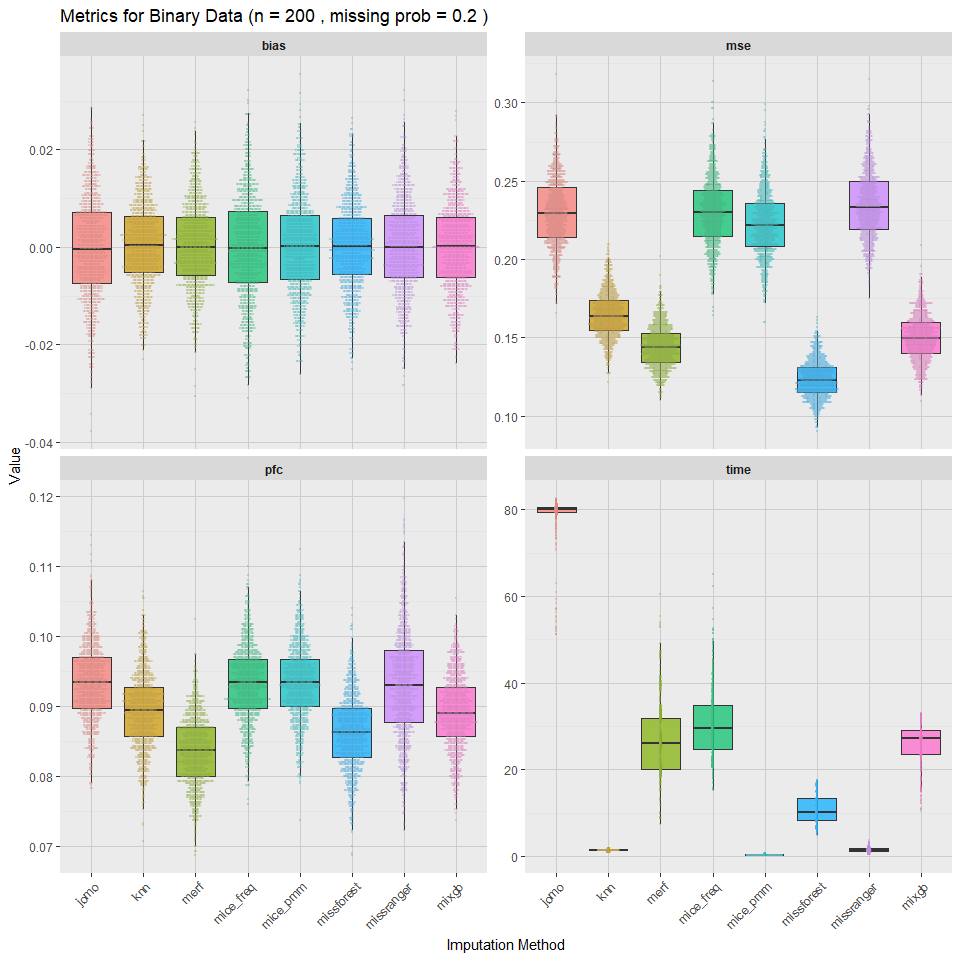
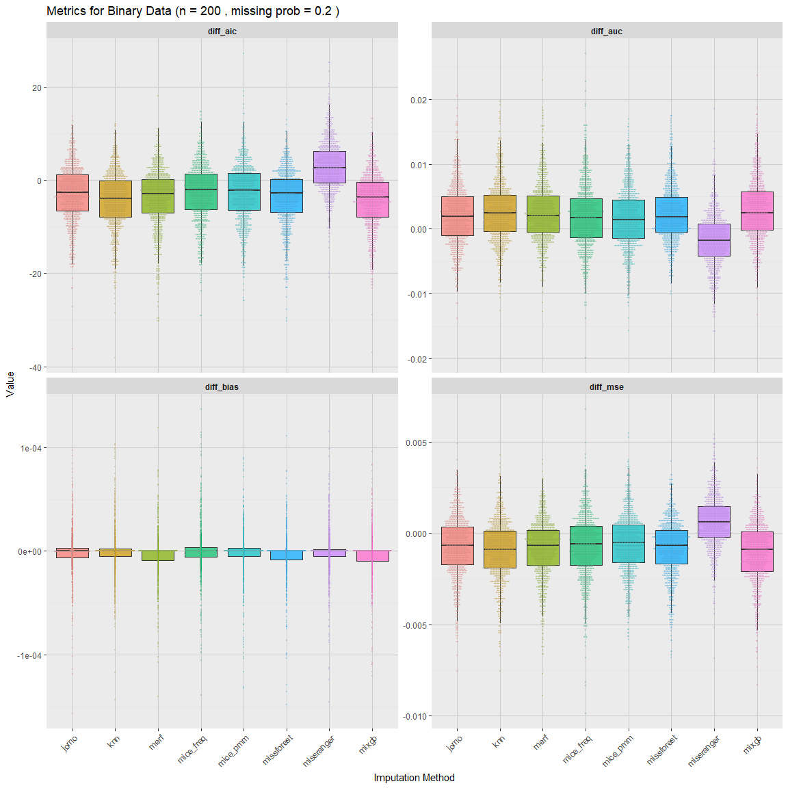
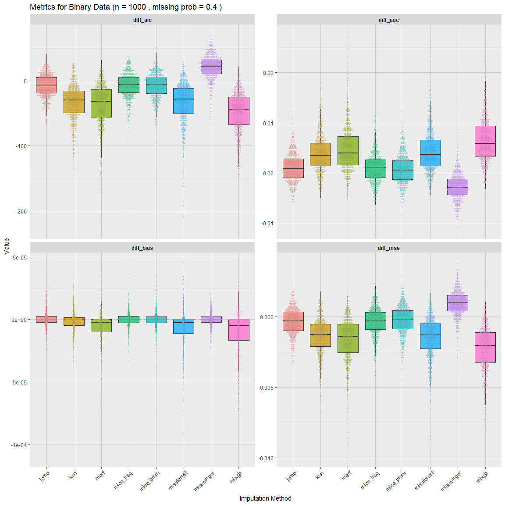
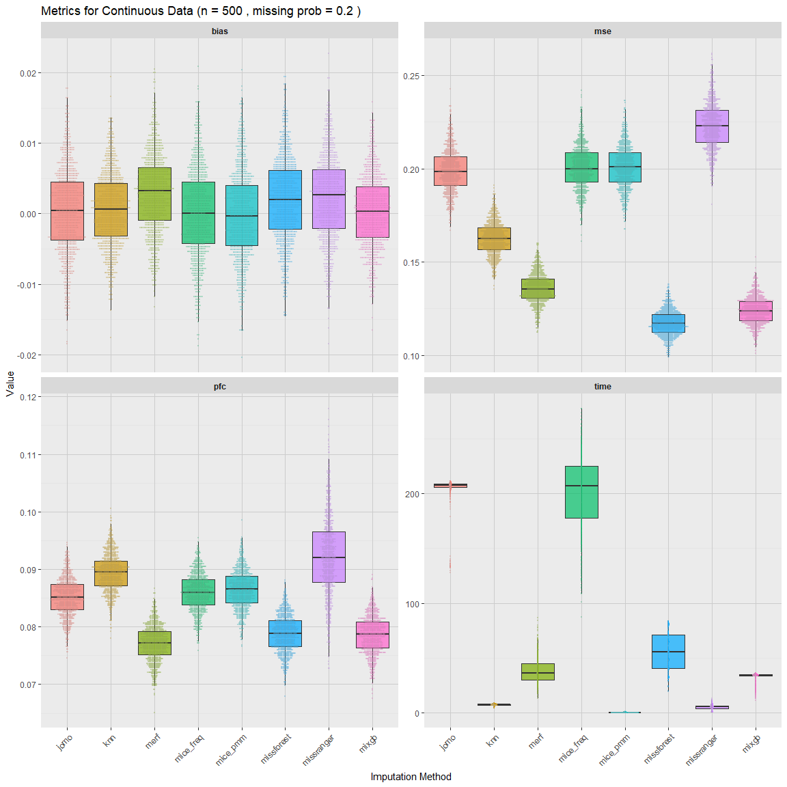
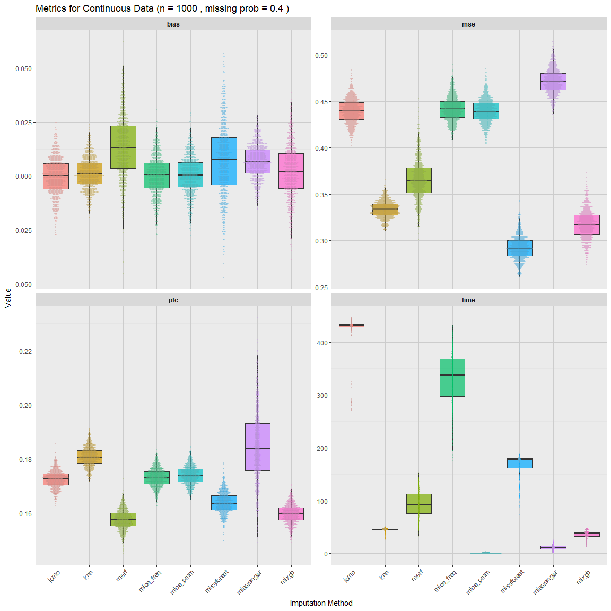
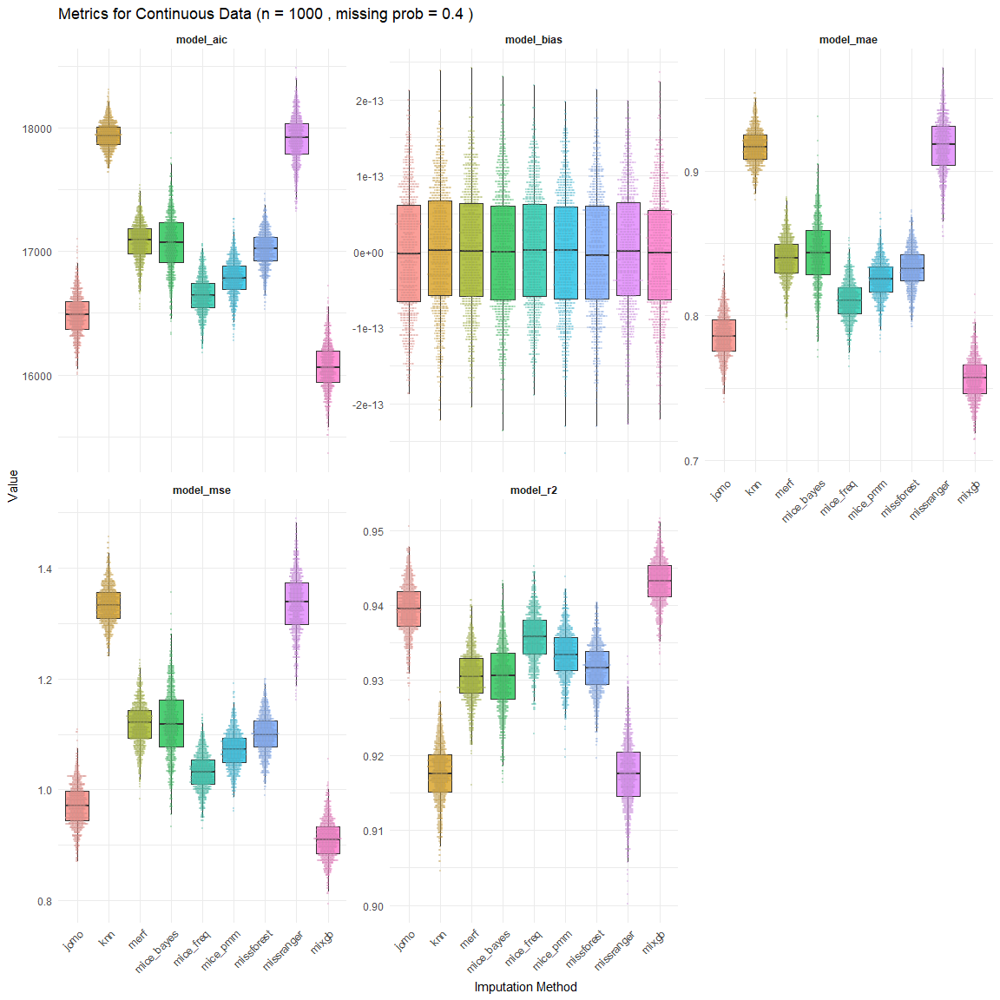
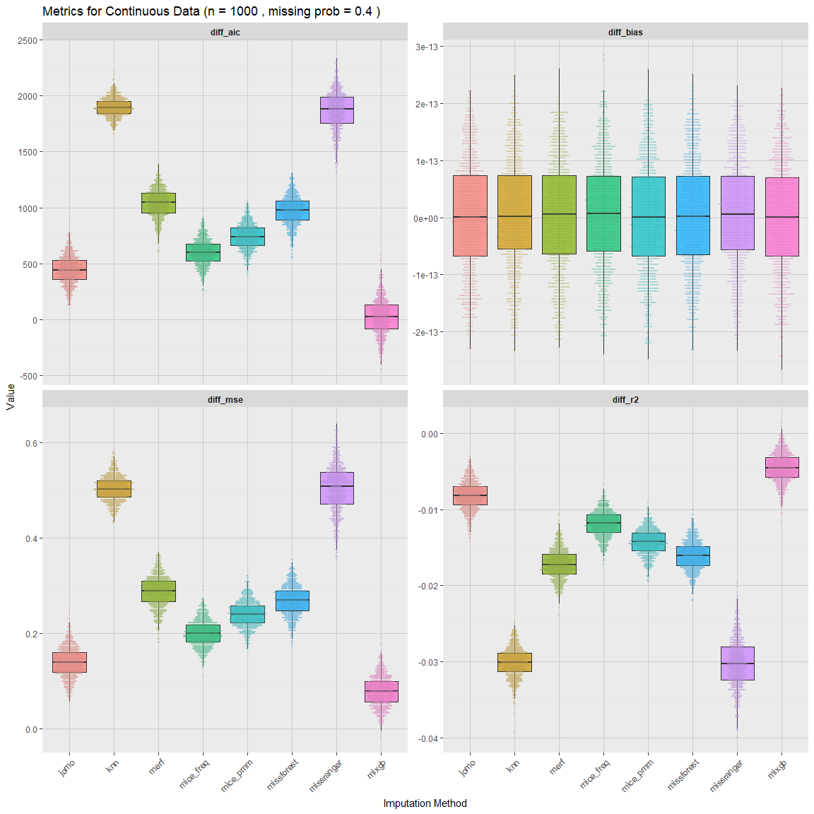

README
================

The goal of this project is to compare methods for imputing missing
data, specifically in the case of clustered data. Data were simulated
for both binary and continuous outcomes, in sample sizes of 200, 500 or
1000, and with either 20% or 40% missingness. Methods of imputation were
compared for each scenario in terms of relevant model fit statistics,
bias, and computation time. The results are as follows:

# Binary Outcome

### 200 subjects w/ 20% Missing Data

<!-- -->

 

<!-- -->

 

<!-- -->

 

### 200 subjects w/ 40% Missing Data

<!-- -->

 

<!-- -->

 

<!-- -->

 

### 500 subjects w/ 20% Missing Data

<!-- -->

 

<!-- -->

 

<!-- -->

 

### 500 subjects w/ 40% Missing Data

<!-- -->

 

<!-- -->

 

<!-- -->

  \### 1000 subjects w/ 20% Missing Data

<!-- -->

 

<!-- -->

 

<!-- -->

 

### 1000 subjects w/ 40% Missing Data

<!-- -->

 

<!-- -->

 

<!-- -->

 

------------------------------------------------------------------------

# Continuous Data

### 200 subjects w/ 20% Missing Data

<!-- -->

 

<!-- -->

 

<!-- -->

 

### 200 subjects w/ 40% Missing Data

<!-- -->

 

<!-- -->

 

<!-- -->

 

### 500 subjects w/ 20% Missing Data

<!-- -->

 

<!-- -->

 

<!-- -->

 

### 500 subjects w/ 40% Missing Data

<!-- -->

 

<!-- -->

 

<!-- -->

  \### 1000 subjects w/ 20% Missing Data

<!-- -->

 

<!-- -->

 

<!-- -->

 

### 1000 subjects w/ 40% Missing Data

<!-- -->

 

<!-- -->

 

<!-- -->

 
